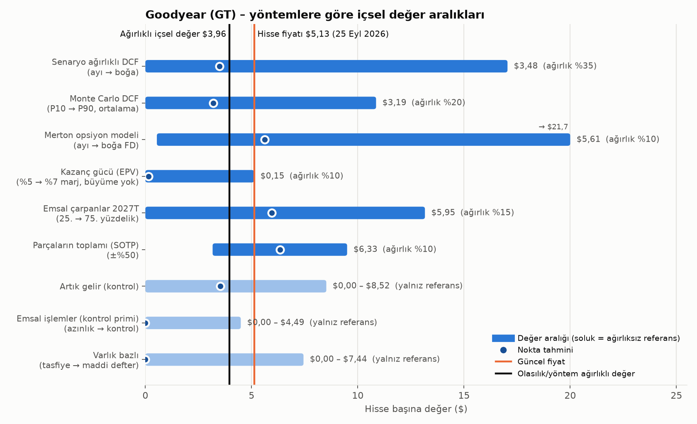
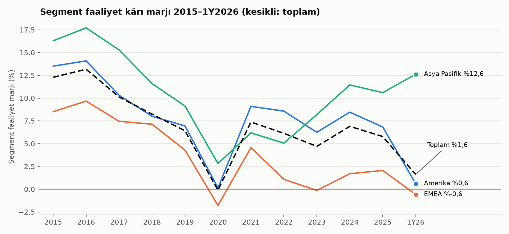
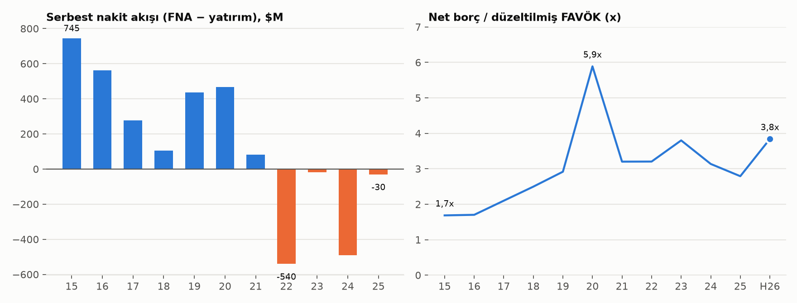
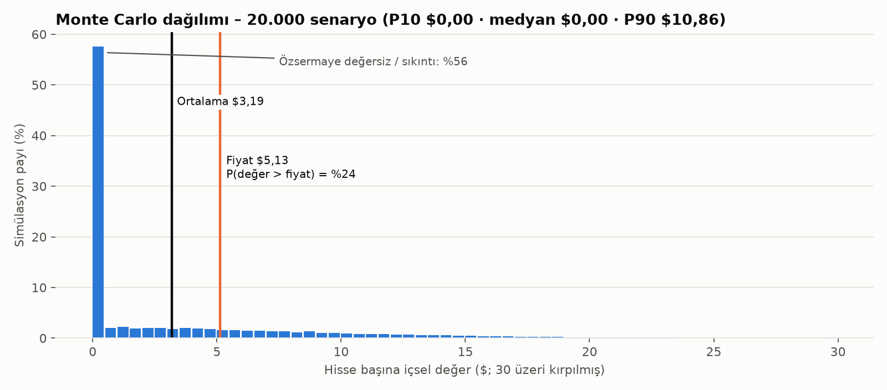

# Goodyear Tire & Rubber (NASDAQ: GT) — Olasılık Ağırlıklı İçsel Değer Analizi

**Analiz tarihi:** 26 Eylül 2026 · **Fiyat referansı:** $5,13 (25.09.2026 kapanışı) · **Son bilanço:** 30.06.2026 (2026/2Ç 10-Q) · **Para birimi:** ABD doları; aksi belirtilmedikçe tutarlar milyon $ · **Muhasebe:** US GAAP, takvim yılı

> **Önemli not:** Bu çalışma bir finansal analizdir, kişisel yatırım tavsiyesi değildir. Hazırlayan lisanslı bir yatırım danışmanı değildir. Risk toleransı, pozisyon büyüklüğü ve karar size aittir. Tüm varsayımlar ekte ve Excel modelinde değiştirilebilir durumdadır.

## 1. Yönetici özeti

**Olasılık ve yöntem ağırlıklı içsel değer: ~$3,96/hisse** (fiyat $5,13; içsel değer fiyatın ~%23 altında). Makul odak aralığı **~$2–6**; tam dağılım çok geniş ve sağa çarpık: Monte Carlo P10 $0,00, P25 $0,00, medyan $0,00, P75 $4,98, P90 $10,86. İçsel değerin fiyatın üzerinde olma olasılığı **~%24**.

**Tez tek cümlede:** GT, ~$8,4 milyarlık işletme değerinin (FD) üstünde ~$1,5 milyarlık ince bir özsermaye dilimidir; bu dilimin değeri neredeyse tamamen segment faaliyet marjının son yedi yılın ortalamasının belirgin üzerine (≈%6,7+) kalıcı olarak dönmesine bağlı bir **opsiyondur**.

Temel bulgular:

1. **10 yıllık gidişat kötü:** Segment faaliyet kârı (SOI) marjı 2016'da %13,2 iken 2025'te %5,8, 2026'nın ilk yarısında %1,6. Normalize ROIC %13,4 → %5,0 (2019'dan beri sermaye maliyetinin altında). 2022–2025 kümülatif serbest nakit akışı −1.078 milyon $; hisse 2016 sonundaki $30,87 seviyesinden $5,13'e geriledi.

2. **Yönetim karnesi ikiye bölünmüş:** Maliyet/sinerji programları brüt bazda sürekli teslim edildi (Cooper sinerjisi $250 milyon, Goodyear Forward $1,5 milyar yıllık etki, $2,2 milyar varlık satışı) — güven skoru 82/100. Buna karşılık çok yıllık marj, kaldıraç ve sermaye iadesi hedeflerinin **tamamı** kaçırıldı ve üçü sessizce geri çekildi (2020 için $3,0 milyar SOI; 2025 sonu için %10 marj ve 2,0–2,5x kaldıraç) — güven skoru 0–27/100. Tasarrufların yalnızca ~%10–30'u net kâra yansıdı.

3. **Piyasanın fiyatladığı:** Ters DCF'ye göre bugünkü fiyat, temel senaryo nakit akışı yapısıyla **uzun vadeli %6,7 SOI marjı** (son yedi yılın yalnızca ikisinde görüldü) ya da aynı nakit akışlarıyla **%8,28 SAMK** gerektiriyor. Piyasa boğa senaryosuna ~%25 olasılık veriyor; bizim tahminimiz %15.

4. **Değeri belirleyen üç değişken:** uzun vadeli SOI marjı (%5 → $0; %7 → $6,86), iskonto oranı (SAMK %10,25 → $0; %8,25 → $5,25) ve gelir büyümesi. 10 yıllık ABD tahvil faizi %5,18 ile yüksek; risk-free %4,5'e normalleşirse (SAMK ≈ %8,55) senaryo DCF'si ≈ $5,21 ile fiyata yaklaşıyor.

5. **Sonuç:** Bugünkü faiz ortamı ve kanıta dayalı temel senaryomuzla hisse, olasılık ağırlıklı içsel değerinin **~%29 üzerinde** fiyatlanıyor (içsel değer fiyatın ~%23 altında); ancak bu bir 'kesin pahalı' hükmü değil — dağılım o kadar geniş ki, 2027'de ~$1 milyar+ SOI'ye dönüş ya da faizlerde düşüş değeri hızla fiyatın üzerine taşır. Güvenlik marjı yok; asimetri 'kazanırsan çok, kaybedersen hepsi' türünden.

| Senaryo | Olasılık | Uzun vadeli SOI marjı | FD (30.06.26) | Özsermaye | Hisse başı değer |
|---|---|---|---|---|---|
| Boğa | %15 | %8,0 | 11.724 | 4.814 | **$17,05** |
| Temel | %45 | %6,0 | 7.475 | 565 | **$2,00** |
| Ayı | %28 | %4,0 | 2.933 | −3.977 | **$0,00** |
| Sıkıntı / yeniden yapılanma | %12 | ayı + finansman olayı | – | – | $0,20 |
| **Senaryo ağırlıklı DCF** | %100 | | | | **$3,48** |

## 2. Şirket, kapsam ve veri

- **Kimlik:** The Goodyear Tire & Rubber Company (Akron, Ohio) · NASDAQ: GT · SEC CIK 0000042582 · mali yıl = takvim yılı · US GAAP · raporlama ve işlem para birimi USD.
- **Hisse yapısı:** Tek sınıf adi hisse; 30.06.2026 itibarıyla 288 milyon hisse, seyreltilmiş ~290 milyon (hisse ödülleri). Piyasa değeri ~1.476 milyon $. Temettü 2020'den beri yok; geri alım 2018'den beri yok.
- **İş:** Dünyanın en büyük lastik üreticilerinden; 48 fabrika, 19 ülke, ~63.000 çalışan. Üç bölge segmenti: Amerika (2025 satışlarının %59'u), EMEA (%30), Asya Pasifik (%11). Markalar: Goodyear, Cooper (2021'de satın alındı), Kelly, Mastercraft/Roadmaster, Fulda, Debica, Sava. ABD'de şirkete ait perakende/servis ağı.
- **2025 portföy sadeleştirmesi:** Off-the-Road lastik işi Yokohama'ya ($905 milyon), Dunlop markası Sumitomo Rubber'a ($701 milyon), kimya işinin çoğu Gemspring'e ($650 milyon) satıldı.
- **İş tipi → yöntem seçimi:** Döngüsel, sermaye yoğun ve yüksek kaldıraçlı bir üretici. Bu nedenle (i) orta döngü normalize kazanç, (ii) senaryo bazlı FCFF DCF, (iii) kaldıraçlı özsermaye için opsiyon yaklaşımı (Merton) ve (iv) Monte Carlo öne çıkar; temettü modeli uygulanamaz.
- **Veri:** SEC EDGAR'dan 10-K 2014–2025, 10-Q 2025/1Ç–2026/2Ç, 2015–2026 arası 51 kazanç bülteni ve ilgili 8-K'lar, 2019–2026 vekâlet beyanları (DEF 14A), Goodyear yatırımcı sunumları (2024/4Ç–2026/2Ç), 2026/2Ç konferans görüşmesi (transkript özeti), XBRL şirket verisi (companyfacts), Yahoo Finance piyasa verisi. Kaynak listesi ve alınamayan veriler Ek C–D'de.

## 3. Son 10 yılın finansalları (yeniden kurulmuş ve normalize edilmiş)

| Kalem | 2015 | 2016 | 2017 | 2018 | 2019 | 2020 | 2021 | 2022 | 2023 | 2024 | 2025 |
|---|---|---|---|---|---|---|---|---|---|---|---|
| Net satış | 16.443 | 15.158 | 15.377 | 15.475 | 14.745 | 12.321 | 17.478 | 20.805 | 20.066 | 18.878 | 18.280 |
| Lastik adedi (milyon) | 166,2 | 166,1 | 159,2 | 159,2 | 155,3 | 126,0 | 169,3 | 184,5 | 173,3 | 166,6 | 158,7 |
| Lastik başına satış ($) | 99 | 91 | 97 | 97 | 95 | 98 | 103 | 113 | 116 | 113 | 115 |
| SOI (segment faaliyet kârı) | 2.020 | 1.996 | 1.556 | 1.274 | 945 | −14 | 1.288 | 1.276 | 943 | 1.302 | 1.057 |
| SOI marjı | %12,3 | %13,2 | %10,1 | %8,2 | %6,4 | −%0,1 | %7,4 | %6,1 | %4,7 | %6,9 | %5,8 |
| — Amerika marjı | %13,5 | %14,1 | %10,3 | %8,0 | %6,9 | %0,1 | %9,1 | %8,6 | %6,2 | %8,5 | %6,8 |
| — EMEA marjı | %8,5 | %9,7 | %7,4 | %7,1 | %4,3 | −%1,8 | %4,6 | %1,1 | −%0,1 | %1,7 | %2,1 |
| — Asya Pasifik marjı | %16,3 | %17,7 | %15,3 | %11,6 | %9,1 | %2,8 | %6,2 | %5,1 | %8,2 | %11,4 | %10,6 |
| Kurumsal gider (normal) | 207 | 168 | 105 | 64 | 110 | 89 | 200 | 160 | 175 | 128 | 168 |
| Yeniden yapılanma (nakit) | 144 | 86 | 154 | 174 | 59 | 186 | 197 | 95 | 99 | 198 | 431 |
| Amortisman (D&A) | 698 | 727 | 781 | 778 | 795 | 859 | 883 | 964 | 1.001 | 1.049 | 1.045 |
| Düzeltilmiş FAVÖK (SOI+D&A−kurumsal) | 2.511 | 2.555 | 2.232 | 1.988 | 1.630 | 756 | 1.971 | 2.080 | 1.769 | 2.223 | 1.934 |
| Normalize FVÖK* | 1.663 | 1.678 | 1.301 | 1.060 | 685 | −253 | 938 | 966 | 618 | 1.024 | 739 |
| Normalize FVÖK marjı | %10,1 | %11,1 | %8,5 | %6,8 | %4,6 | −%2,1 | %5,4 | %4,6 | %3,1 | %5,4 | %4,0 |
| Normalize NOPAT (%25 vergi) | 1.247 | 1.258 | 976 | 795 | 514 | −190 | 704 | 724 | 464 | 768 | 554 |
| Normalize ROIC | %13,6 | %13,4 | %9,9 | %7,9 | %5,2 | −%2,1 | %6,8 | %5,8 | %3,7 | %6,4 | %5,0 |
| GAAP net kâr | 307 | 1.264 | 346 | 693 | −311 | −1.254 | 764 | 202 | −729 | 46 | −1.721 |
| Faaliyet nakit akışı (FNA) | 1.728 | 1.557 | 1.158 | 916 | 1.207 | 1.115 | 1.062 | 521 | 1.032 | 698 | 796 |
| Yatırım harcaması | 983 | 996 | 881 | 811 | 770 | 647 | 981 | 1.061 | 1.050 | 1.188 | 826 |
| Serbest nakit akışı (FNA−capex) | 745 | 561 | 277 | 105 | 437 | 468 | 81 | −540 | −18 | −490 | −30 |
| Hisse geri alımı | 180 | 500 | 400 | 220 | 0 | 0 | 0 | 0 | 0 | 0 | 0 |
| Temettü | 68 | 82 | 110 | 138 | 148 | 37 | 0 | 0 | 0 | 0 | 0 |
| Net borç | 4.232 | 4.347 | 4.686 | 4.962 | 4.755 | 4.451 | 6.309 | 6.663 | 6.722 | 6.972 | 5.397 |
| Net borç / düz. FAVÖK | 1,7x | 1,7x | 2,1x | 2,5x | 2,9x | 5,9x | 3,2x | 3,2x | 3,8x | 3,1x | 2,8x |
| Ana ortaklık özsermayesi | 3.920 | 4.507 | 4.603 | 4.864 | 4.351 | 3.078 | 4.999 | 5.300 | 4.668 | 4.681 | 3.233 |
| Yıl sonu hisse sayısı (milyon) | 267 | 252 | 240 | 232 | 233 | 233 | 282 | 283 | 284 | 285 | 286 |
| Yıl sonu hisse fiyatı ($) | 32,67 | 30,87 | 32,31 | 20,41 | 15,56 | 10,91 | 21,32 | 10,15 | 14,32 | 9,00 | 8,76 |
| FD / düz. FAVÖK | 5,2x | 4,8x | 5,7x | 5,0x | 5,3x | 9,5x | 6,3x | 4,7x | 6,2x | 4,4x | 4,2x |
| Piyasa değeri / defter değeri | 2,23x | 1,73x | 1,68x | 0,97x | 0,83x | 0,83x | 1,20x | 0,54x | 0,87x | 0,55x | 0,77x |

*Normalize FVÖK = SOI − kurumsal gider − $150 milyon normalize yeniden yapılanma. Kaynak: SEC XBRL (her yıl için en son dosyalanan değer; yeniden düzenlemeler dahil) ve 10-K segment notları. 2023–2024 SOI, 2025'te Türkiye kur çevrimi hatası nedeniyle yeniden düzenlenmiş değerlerdir (ilk açıklanan 968 ve 1.318). Son 12 ay (Haz-2026): satış 17.693, SOI 834 (marj %4,7), net borç 6.329, net borç/düz. FAVÖK 3,8x.

**Okuma notları ve normalizasyon kararları**

- **Hacim ve fiyatlama:** Satış 10 yılda %11 arttı ama bunun kaynağı Cooper satın alması ve 2021–2023 enflasyon fiyatlaması; lastik adedi 166,2 milyondan 158,7 milyona düştü. Lastik başına satış %16 arttı; aynı dönemde ABD TÜFE ~%35 yükseldi → reel fiyat/karma erozyonu.
- **Yeniden yapılanma 'tek seferlik' değil:** Goodyear son 11 yılın her birinde yeniden yapılanma gideri yazdı (nakit ortalaması ~$170 milyon/yıl). Bu yüzden normalize kazançtan $150 milyon/yıl düşüldü; DCF'de 2027 $250 milyon, 2028 $150 milyon, sonrası $100 milyon (temel).
- **Kurumsal giderler:** SOI kurumsal teşvik primlerini ve dağıtılmayan genel giderleri içermez; 2016–2025 ortalaması ~$140 milyon, 2026 rehberi ~$150 milyon.
- **Vergi:** 2025'te ABD ertelenmiş vergi varlıklarına tam değerleme karşılığı ayrıldı (net kâra −$1,5 milyar, nakitsiz). ABD'de ~$1,4 milyar, Lüksemburg'da ~$1,1 milyar vergi varlığı karşılıklı; bu, kârlılık dönerse gelecekte vergi kalkanı demek. Modelde 2032'ye kadar %20 nakit vergi oranı (yabancı vergiler için $150 milyon taban) ve sonrasında %24 kullanıldı.
- **Emeklilik:** ABD planları fazla fonlu (+$77 milyon); ABD dışı (−$215 milyon) ve diğer yan haklar (−$231 milyon) ile net açık $369 milyon → borç benzeri kalem.
- **Kiralamalar ve faktoring:** Operasyonel kira gideri faaliyet giderinde bırakıldı (kira yükümlülüğü borca eklenmedi). Bilanço dışı faktoring ($830 milyon) borca eklenmedi, bunun yerine yıllık ~$35 milyon maliyeti nakit akışından düşüldü. Tedarikçi finansmanı ($550 milyon) ticari borçlar içinde; kaldıraç riski olarak not edildi.
- **Kazançtan nakde köprü (2025):** GAAP net zarar −$1.700 milyon → FNA +$796 milyon: +D&A 1.045, +şerefiye değer düşüklüğü 674, +vergi varlığı karşılığı 1.357, +emeklilik tasfiye 201, −varlık satış kârı 816, −yeniden yapılanma (ödenen − gider) 237, +işletme sermayesi ve diğer. **Dikkat:** 2025 FNA'sı, varlık satışlarıyla ilgili ~$376 milyon tek seferlik ertelenmiş tahsilat içeriyor; bu arındırıldığında 2025 serbest nakit akışı ~−$0,4 milyar.
- **Serbest nakit:** 2015–2021 kümülatif +$2,7 milyar; 2022–2025 kümülatif −$1,08 milyar; 2026 rehberi −$200/−$300 milyon. Kısacası şirket dört yıldır faizden sonra nakit yakıyor; borç azaltımı varlık satışlarıyla yapıldı.

## 4. Şirketin gidişatı: iş kalitesi, getiri ve riskler

**Sektör yapısı.** Premium ve orta segment rakipler (Michelin, Bridgestone, Continental, Pirelli, Yokohama, Toyo) ~%9–16 faaliyet marjı ve güçlü bilançolarla çalışırken, Asya'dan (Çin, Tayland, Vietnam, Kamboçya) düşük maliyetli ithalat özellikle ABD ve AB yedek (replacement) pazarında pay kazanıyor. Goodyear'ın 2026/1Y'de küresel yedek hacmi %13, Amerika yedek hacmi %18 düştü; şirket bunu kısmen 'düşük segment ürünlerin bilinçli rasyonalizasyonu', kısmen rekabet ve kanal stok erimesiyle açıklıyor. OE (orijinal ekipman) tarafında ise 10 çeyrektir EMEA'da pay kazanıyor — gelecekteki yedek talep için olumlu, bugünkü marj için değil.

**Segment ekonomisi.** Asya Pasifik en kârlı birim (2026/1Y marj %12,6). Amerika 2024'te %8,5 marjdan 2026/1Y'de %0,6'ya çöktü (hacim, eksik kapasite kullanımı ~$300 milyon, tarifeler). EMEA yapısal olarak başabaş civarında (2021–2025 ortalaması %1,8); yüksek maliyetli Alman fabrikaları kapatıldı (Fulda, Fürstenwalde), Güney Afrika Kariega kapatıldı; Mart 2026'da ek bir EMEA planı (~400 net pozisyon, 2029'dan itibaren +$50 milyon/yıl) açıklandı.

**Getiri vs sermaye maliyeti.** Normalize NOPAT getirisi 2015–2017'de %10–14 iken 2019'dan beri %3,7–6,8 aralığında; bugünkü SAMK (~%9,25) bir yana, faiz sonrası bile nakit üretmiyor. Bu nedenle büyüme bugünkü yapıda değer **yaratmıyor**; temel senaryoda yeni yatırım getirisi (RONIC) = SAMK varsayıldı.

**Hendek (moat).** Marka bilinirliği, OE ilişkileri, ABD üretim ayak izi (tarifelere karşı görece avantaj) ve perakende ağı gerçek varlıklar; ancak birim fiyatın enflasyonun gerisinde kalması ve 7 yıldır sermaye maliyetinin altında getiri, bu hendeğin getirileri korumadığını gösteriyor. Aşırı getirilerin söndüğü (fade) değil, zaten söndüğü bir durum.

**Muhasebe ve finansal sağlık taramaları**

| Yıl | Altman Z | Beneish M | Sloan tahakkuk | SOI/faiz | Düz. FAVÖK/faiz | Alacak gün | Stok gün | Borç gün |
|---|---|---|---|---|---|---|---|---|
| 2016 | 2,19 | −2,67 | −0,017 | 5,4x | 6,9x | 43 | 88 | 86 |
| 2019 | 1,67 | −2,88 | −0,088 | 2,8x | 4,8x | 48 | 90 | 92 |
| 2021 | 1,58 | −2,20 | −0,015 | 3,3x | 5,1x | 50 | 96 | 111 |
| 2023 | 1,40 | −2,78 | −0,080 | 1,8x | 3,3x | 50 | 81 | 95 |
| 2024 | 1,45 | −2,81 | −0,031 | 2,5x | 4,3x | 48 | 85 | 98 |
| 2025 | 1,45 | −3,27 | −0,128 | 2,4x | 4,3x | 47 | 87 | 95 |

- Altman Z 2019'dan beri 1,81'in altında ("sıkıntı bölgesi"); 2026 için SOI/faiz ~1,4x (≈$600M/$425M). Beneish M hiçbir yıl −2,22 eşiğini aşmıyor (manipülasyon sinyali yok). 2025'te Türkiye kur çevrimi hatası nedeniyle önemsiz bir geriye dönük düzeltme yapıldı; denetçi PwC.
- Kısıtlı nakit: $179 milyon nakit (Çin, Güney Afrika, Sırbistan, Arjantin) transfer kısıtlı. Borçluluk kovenantı yalnızca likidite $275 milyonun altına inerse devreye giriyor; 30.06.2026'da kullanılabilir likidite ~$3,9 milyar + $0,86 milyar nakit.

**Başlıca riskler:** (1) Kaldıraç ve refinansman — Haziran 2026'da $1,05 milyar %8,875 kuponlu 2032 vadeli tahvil (marjinal borç maliyeti çok yüksek); S&P'nin notu BB−'den B+'ya indirdiği bildiriliyor (başlık doğrulandı, tarihi doğrulanamadı), Moody's B1; (2) tarifeler ve ithalat rejimi (yıllık ~$300 milyon tarife maliyeti; IEEPA iadeleri belirsiz); (3) hammadde (Orta Doğu çatışması nedeniyle 2026/2Y'de ~$200 milyon ek maliyet beklentisi); (4) yedek pazarda yapısal pay kaybı; (5) EMEA'nın kalıcı zayıflığı; (6) 2030 civarında Dunlop tedarik anlaşmasının (yılda en az 4,5 milyon lastik) bitişi; (7) ticari kamyon döngüsü; (8) CFO'suz dönem (geçici CFO Temmuz 2026'dan beri); (9) sendika sözleşmeleri (USW ile Nisan 2029'a kadar geçerli, üye onayına tabi geçici anlaşma); (10) asbest ve ürün sorumluluğu (net ~$50 milyon asbest).

## 5. Yönetim kalitesi

**Zaman çizelgesi:** Richard Kramer 2010–Ocak 2024 CEO/Başkan. Temmuz 2023'te aktivist Elliott ile işbirliği anlaşması: 3 yeni bağımsız üye ve Stratejik ve Operasyonel İnceleme Komitesi. Kasım 2023'te 'Goodyear Forward' dönüşüm planı. Ocak 2024'te Mark Stewart (eski Stellantis Kuzey Amerika COO'su, Amazon, ZF TRW) CEO oldu; Laurette Koellner icracı olmayan başkan. CFO Christina Zamarro Temmuz 2026'da ayrıldı; Scott Deakin geçici CFO.

**Sermaye tahsisi karnesi (10 yıl)**

| Karar | Tutar | Sonuç |
|---|---|---|
| Hisse geri alımı 2014–2018 | ~$1,5 milyar (~52 milyon hisse, ort. ~$29) | Bugün ~$5 → değerin ~%80'i eridi |
| Temettü 2013–2020 | ~$0,65 milyar | 2020'de askıya alındı |
| Cooper Tire (2021) | ~$2,8 milyar özsermaye değeri; ~6,4x FAVÖK (2020) | Sinerji hedefi ($165M→$250M) tuttu; ama Amerika SOI'si 2023'te pro forma seviyenin altında; 2024'te $125M marka, 2025'te $674M şerefiye değer düşüklüğü |
| Yatırım (2021–2024) | Yıllık $1,0–1,2 milyar (D&A üstü) | Hacim ve marj artışı gelmedi; 2025–26'da $826M/$725M'ye kısıldı |
| Varlık satışları (2025) | ~$2,2 milyar brüt (OTR ~7x, Dunlop ~9,7x SOI, Kimya ~4,3x FAVÖK) | Hedefin üstünde; borç azaltıldı ama 2026'da ~$185M SOI kaybı |

**Teşvikler ve yönetişim (DEF 14A 2026):**
- 2025 yıllık prim hedefi: SOI marjı **%6,91** — kamuya açıklanan %10 hedefinin çok altında. Ücret komitesi SOI'yi tarifeler için +$148 milyon düzeltti (%6,12 sayıldı).
- Serbest nakit akışı hedefi $450 milyon; raporlanan FNA−capex −$30 milyon iken prim hesabında **+$467 milyon** sayıldı (yeniden yapılanma ödemeleri +$431M, tarifeler +$251M, 'hedef üstü varlık satış gelirleri' +$186M, Goodyear Forward ödemeleri +$132M eklendi). Yıllık prim ödemesi %98.
- 2023–2025 uzun vadeli teşvik ödemesi %96 (TSR çarpanı 0,83x olmasına rağmen 'stratejik girişim endeksi' +25 puan ekledi). CEO toplam ücreti 2024'te $25,8 milyon, 2025'te $14,6 milyon.
- Yönetim ve yönetim kurulu toplam payı %1'in altında (~1,07 milyon hisse). Haziran 2025'ten beri tek açık piyasa alımı: bir yönetim kurulu üyesi (Kasım 2025, 100 bin hisse, $7,55). 2026'daki %40'lık düşüşte içeriden alım yok; satış da yok (yalnızca vergi stopajı).
- Açığa satış oranı serbest dolaşımın ~%22'si (piyasa şüpheci).

**Değerlendirme (analist yargısı):**

| Boyut | Puan (10) | Gerekçe |
|---|---|---|
| Operasyonel uygulama | 7 | Maliyet programları, sinerji ve varlık satışları vaktinde ve hedef üstünde |
| Stratejik sonuç | 2 | Marj, ROIC, FCF ve TSR on yıldır geriliyor; tasarruflar enflasyon ve hacim kaybında eriyor |
| Sermaye tahsisi | 3 | Pahalıdan geri alım, döngü tepesinde satın alma, sonra zorunlu varlık satışı |
| Teşvik uyumu | 3 | İç hedefler dış hedeflerden düşük; bol düzeltmeli FCF; düşük içeriden sahiplik |
| Şeffaflık | 4 | Detaylı köprü tabloları iyi; ama başarısız hedefler açıklamasız bırakıldı |
| **Genel** | **~4** | Elliott sonrası ekip daha disiplinli, fakat sonuç kanıtı henüz yok |

## 6. Hedefler ne kadar gerçekleşti? (rehberlik karnesi)

Yöntem: Her hedef için 'gerçekleşme oranı' = (gerçekleşen − başlangıç) / (hedef − başlangıç), yani vaat edilen **değişimin** ne kadarının geldiği. Sessizce geri çekilen hedefler 'kaçırıldı' sayıldı. 2026'ya ait açık kalemler 'ara' olarak raporlandı ama puana katılmadı.

| # | Hedef | Veriliş | Durum | Değişimin gerçekleşmesi | Seviye gerçekleşmesi |
|---|---|---|---|---|---|
| G01 | 2014 SOI büyümesi %10–15 (2014–16 planı) | 2014-02 | Kaçırıldı | %67 | %96 |
| G02 | 2015 SOI büyümesi %10–15 | 2014-02 | Tuttu | %145 | %105 |
| G03 | 2016 rekor SOI $2,1–2,2 milyar (Venezuela hariç) | 2016-02-09 | Kaçırıldı | %33 | %92 |
| G04 | 2017 SOI 2016 ile yatay (~$2,0 milyar) | 2017-02-08 | Kaçırıldı | anlamsız (hedef ≈ başlangıç) | %76 |
| G05 | 2018 SOI $1,8–1,9 milyar | 2018-02-08 | Kaçırıldı | −%76 | %69 |
| G06 | 2023/2Y SOI marjı 'yakın vadeli %8 hedefine çok yakın' | 2023-05-04 | Kısmen | %86 | %90 |
| G07 | 2026 SOI: Şubat köprüsü (~$0,9 milyar, hacim hariç; analist yeniden kurgusu) → Ağustos ima ~$0,6 milyar | 2026-02-10 | Ara (2026) | −%200 | %67 |
| G08 | 2020 SOI hedefi $3,0 milyar (Yatırımcı Günü 2016) | 2016-09-15 | Sessizce geri çekildi | −%102 | %32 |
| G09 | 2020 SOI hedefi $2,0–2,4 milyar (revize) | 2018-02-08 | Sessizce geri çekildi | −%85 | %43 |
| G10 | 4Ç2025'te ~%10 SOI marjı (Goodyear Forward) | 2023-11-15 | Sessizce geri çekildi | −%8 | %73 |
| G11 | 2025 sonunda 2,0–2,5x net kaldıraç | 2023-11-15 | Sessizce geri çekildi | %65 | %124 |
| G12 | 2016 sonunda 2,0–2,1x düzeltilmiş borç/FAVÖKP | 2015-02-17 | Sessizce geri çekildi | %0 | – |
| G13 | 2017–2020 kümülatif FCF $4,3–4,9 milyar | 2016-09-15 | Kaçırıldı | %28 | %28 |
| G14 | 2017–2020 hissedara $4 milyara kadar dağıtım | 2016-09-15 | Kaçırıldı | %26 | %26 |
| G15 | EMEA Hanau/Fulda modernizasyonu: 2020'den itibaren 3 yılda +$60–70M SOI | 2019-04-26 | Sessizce geri çekildi | %0 | – |
| G16 | Cooper sinerjisi 2 yılda $165M (2023 ortasına $250M'ye yükseltildi) | 2021-02-22 | Tuttu | %152 | %152 |
| G17 | Goodyear Forward 2024 brüt fayda ~$350M ($450M'ye yükseltildi) | 2024-02-12 | Tuttu | %137 | %137 |
| G18 | Goodyear Forward 2025 brüt fayda ~$750M | 2024-11-04 | Tuttu | %103 | %103 |
| G19 | Goodyear Forward 4Ç25 yıllık etki $1,3 milyar ($1,5 milyara yükseltildi) | 2023-11-15 | Tuttu | %115 | %115 |
| G20 | OTR/Dunlop/Kimya satışından >$2 milyar brüt gelir | 2023-11-15 | Tuttu | %110 | %110 |
| G21 | 2025 capex ~$950M | 2025-02-13 | Tuttu | – | %87 |
| G22 | 2025 yeniden yapılanma ödemeleri ~$400M | 2025-02-13 | Tuttu | – | %108 |
| G23 | 2025 faiz gideri $450–475M | 2025-02-13 | Tuttu | – | %96 |
| G24 | 2025 işletme sermayesi girişi $100–150M | 2025-02-13 | Kaçırıldı | – | −%17 |
| G25 | 2025 nakit vergi ~$200M | 2025-02-13 | Tuttu | – | %80 |
| G26 | 2026 işletme sermayesi girişi ~$100M (Şub) → nötr (Ağu) | 2026-02-10 | Ara (2026) | – | %0 |
| G27 | 2026 hammadde faydası ~$300M (Şub) → ~nötr (May) | 2026-02-10 | Ara (2026) | – | %0 |
| G28 | 2025 ticari yedek lastik sektörü +%2–4 | 2025-02-13 | Kaçırıldı | – | – |

**Kategori bazında güven skorları**

| Kategori | Adet | İsabet oranı | Medyan değişim gerçekleşmesi | Geri çekilen | Güven (0–100) |
|---|---|---|---|---|---|
| 1 yıllık SOI/marj rehberliği | 6 | %25 | %50 | 0 | **38** |
| Çok yıllık SOI/marj hedefleri | 3 | %0 | −%85 | 3 | **0** |
| Kaldıraç hedefleri | 2 | %0 | %33 | 2 | **20** |
| FCF ve sermaye iadesi hedefleri | 2 | %0 | %27 | 0 | **27** |
| Maliyet/sinerji programları (brüt) | 5 | %80 | %115 | 1 | **82** |
| Varlık satış gelirleri | 1 | %100 | %110 | 0 | **70** |
| Yıllık nakit kalemleri (capex, faiz, vergi…) | 5 | %80 | %115 | 0 | **90** |
| Sektör varsayımları | 1 | %0 | – | 0 | **20** |

**Desenler:** (1) 2016, 2017 ve 2018'de yıllık SOI rehberliği art arda yıl ortasında düşürüldü; 2018'de son düşürülen rakam bile tutmadı. (2) Uzun vadeli hedeflerin tamamı kaçırıldı: 2020 için $3,0 milyar SOI (gerçekleşen 2019: $945 milyon), 2017–2020 kümülatif $4,3–4,9 milyar FCF (gerçekleşen ~$1,3 milyar), 2025 sonu %10 marj (gerçekleşen 4Ç25: %8,5, sigorta tazminatı hariç %7,3) ve 2,0–2,5x kaldıraç (gerçekleşen ~2,8x; Haz-26'da 3,8x). Son ikisi Ağustos 2025'te sessizce söylemden çıkarıldı. (3) Brüt tasarruflar her seferinde tuttu ya da aştı, fakat 2024–2025'te $1,25 milyar brüt fayda varken SOI yalnızca +$114 milyon arttı (2023→2025). (4) Kısa vadeli nakit kalemleri (capex, faiz, vergi, yeniden yapılanma ödemeleri) güvenilir.

**Modele nasıl taşındı (aritmetik):**
- 2026 SOI: yönetimin ima ettiği ~$600 milyonun %95'i → temel $570M (ayı $500M, boğa $630M).
- Orta vadeli marj hedefleri (güven 0): %10 hedefi hiçbir senaryoya girmedi; boğa senaryosu bile %8'de sınırlandı. Temel senaryo, 2021–2025 gerçekleşmelerinden aşağıdan yukarıya kuruldu.
- Açıklanan yeni tasarruflar (Fayetteville +$270M/yıl, EMEA +$50M/yıl): brüt teslim güvenilir, net tutunma düşük → temel %50, ayı %25, boğa %90.
- 2026 FCF rehberi (−$200/−$300M): nakit kalemleri güvenilir ama işletme sermayesi rehberi iki kez kaçtı → temel −$325M, ayı −$450M, boğa −$225M.

## 7. Gelecek projeksiyonları

**Yönetimin güncel rehberliği (Ağustos 2026):** 2026 SOI ~$600 milyon (2025 düzeltilmiş baz ~$800M + fiyat/karma >$200M − tarifeler ~$50M − hacim/sabit gider emilimi ~$350M; Goodyear Forward enflasyonu dengeliyor); 3Ç26: hacim yatay, GF +$70M, fiyat/karma +$110M, hammadde −$20M, eksik kapasite −$70M, enflasyon −$95M, satılan işler −$57M; 2026 FCF −$200/−$300M; capex ~$725M; faiz ~$425M; yeniden yapılanma ödemeleri ~$265M; nakit vergi $150–175M; D&A ~$915M; işletme sermayesi ~nötr. Fayetteville (Kuzey Karolina) fabrikasının kapanışı: 2027'de +$90M, 2028'den itibaren +$270M/yıl Amerika SOI etkisi; $535–565M toplam gider, $190–210M nakit.

**Piyasa beklentisi (Yahoo, 7–8 analist):** 2026 düzeltilmiş EPS −$0,69; 2027 +$0,53 (aralık $0,22–0,94); 2027 satış $17,9 milyar; ortalama hedef fiyat $7,46 ($6–10), öneri 'tut'. 2027 EPS konsensüsü ~$1,05 milyar SOI'ye denk geliyor — temel senaryomuzun ($890M) üzerinde.

**Senaryo projeksiyonları (seçilmiş yıllar)**

| Senaryo | Yıl | Satış | SOI marjı | SOI | FAVÖK* | Capex | FCFF | Net borç/FAVÖK |
|---|---|---|---|---|---|---|---|---|
| Boğa | 2027 | 17.974 | %6,0 | 1.078 | 1.825 | 775 | 516 | 3,0x |
| Boğa | 2028 | 18.603 | %7,0 | 1.302 | 1.995 | 800 | 722 | 2,6x |
| Boğa | 2030 | 19.735 | %8,0 | 1.579 | 2.256 | 849 | 916 | 1,8x |
| Boğa | 2035 | 22.438 | %8,0 | 1.795 | 2.550 | 965 | 1.053 | 0,1x |
| Temel | 2027 | 17.799 | %5,0 | 890 | 1.636 | 775 | 327 | 3,5x |
| Temel | 2028 | 18.244 | %5,6 | 1.022 | 1.734 | 839 | 446 | 3,3x |
| Temel | 2030 | 19.168 | %6,0 | 1.150 | 1.858 | 882 | 562 | 2,9x |
| Temel | 2035 | 21.266 | %6,0 | 1.276 | 2.048 | 978 | 658 | 2,0x |
| Ayı | 2027 | 17.537 | %3,8 | 666 | 1.413 | 750 | 134 | 4,3x |
| Ayı | 2028 | 17.713 | %4,0 | 709 | 1.426 | 850 | 133 | 4,5x |
| Ayı | 2030 | 18.069 | %4,0 | 723 | 1.424 | 867 | 131 | 5,0x |
| Ayı | 2035 | 18.990 | %4,0 | 760 | 1.475 | 912 | 170 | 6,1x |

*FAVÖK = SOI + D&A − kurumsal gider (US GAAP, kira gideri dahil). FCFF: vergi, capex, işletme sermayesi, yeniden yapılanma, faktoring maliyeti ve nakitsiz ertelenmiş gelir çıkarılmış hali.

- **Boğa (%15):** Yönetim planı büyük ölçüde teslim edilir: Fayetteville/EMEA tasarruflarının ~%90'ı net kâra yansır, yedek pazar hacmi toparlanır, fiyatlama tutunur; SOI marjı 2029'da %8'e ulaşır (yine de geri çekilen %10 hedefinin ve emsallerin ~%11'inin altında). Borç 2031'de FAVÖK'ün ~1,5 katına iner.
- **Temel (%45):** 2021–2025 ortalaması olan ~%6 SOI marjına dönüş: eksik kapasite kullanımı geri döner, ayak izi tasarruflarının ~%50'si enflasyondan sonra kalır, alt segmentte pay kaybı sürer. Kaldıraç ancak 2030'da 3x'in altına iner; büyüme değer yaratmaz (RONIC = SAMK).
- **Ayı (%28):** Düşük maliyetli ithalat pay almaya devam eder, tasarruflar 2024–25'teki gibi enflasyonda erir, EMEA başabaşta kalır; marj 2023–2026 ortalaması olan ~%4'te takılır. Faizden sonra nakit üretilemez, net borç/FAVÖK 2030'da 5x, 2035'te 6x'e çıkar.
- **Sıkıntı (%12):** Ayı operasyonları + refinansman/likidite olayı (%8,875 marjinal borç maliyeti, 5x+ kaldıraç): borcun özsermayeye dönüştürülmesi veya çok seyreltici kurtarma sermayesi; mevcut hissedarlara yalnızca küçük bir opsiyon kalır.

**Olasılıkların dayanağı:** (i) GT'nin kendi marj geçmişi — son 7 yılda SOI marjı 0 yılda ≥%8, 4 yılda %6–8, 3 yılda <%6 (üstüne 1Y26'da %1,6); (ii) orta vadeli marj hedeflerinin güven skoru 0/100 → yönetim benzeri sonuç %15'lik boğa senaryosuyla sınırlandı; (iii) B+/B1 notları, negatif 2026 FCF'si ve 3,8x kaldıraç, tek-B+ ihraççılar için ~%10–15'lik 5 yıllık kümülatif temerrüt oranlarıyla birlikte → %12 sıkıntı. Temel/ayı arasındaki 45/28 bölüşümü analist yargısıdır. Tarihsel taban oran kontrolü: son 7 yılın 2'sinde (~%29) marj ters DCF'nin gerektirdiği ~%6,7'ye ulaştı; Monte Carlo'nun %24'lük 'fiyatın üstünde değer' olasılığıyla tutarlı.

## 8. Değerleme — farklı yöntemler

### 8.1 Sermaye maliyeti (SAMK)

| Bileşen | Değer | Not |
|---|---|---|
| Risksiz faiz (10Y ABD) | %5,20 | 25.09.2026: %5,18 (bahar 2026'da ~%4,3) |
| Hisse risk primi | %4,50 | ABD zımni prim aralığı %4,2–4,6 |
| Varlık betası | 1,00 | Lastik emsalleri 0,9–1,15; GT'nin kendi 2/3/5 yıllık haftalık betası 0,57/0,85/1,38 (korelasyon <0,45, gürültülü) |
| Borç betası / beklenen borç getirisi | 0,50 / %7,45 | Vaat edilen getiri ~%8,75–8,9 (beklenen temerrüt kaybı dahil) |
| Hedef borç/değer | %50 | Piyasa ağırlıklarıyla ~%82 |
| Vergi kalkanı oranı | %10 | ABD/Lüksemburg vergi varlıkları karşılıklı → faiz kalkanı sınırlı |
| Kaldıraçsız sermaye maliyeti | %9,70 | |
| Özsermaye maliyeti (hedef kaldıraç) | %11,72 | Özsermaye betası 1,45; bugünkü piyasa kaldıracında %19,1 |
| **SAMK (hesaplanan / kullanılan)** | **%9,21 / %9,25** | Duyarlılık %8,25–10,25 |

### 8.2 Senaryo bazlı FCFF DCF

Nakit akışları 01.07.2026'dan başlar; 2026/2Y FCFF yönetimin yıllık FCF rehberinden (bizim düzeltmemizle) ve 2Y faiz ödemesinden türetildi; 2027–2035 aşağıdan yukarıya; yıl ortası iskonto. Terminal değer 'değer sürücüsü' formülüyle: NOPAT × (1 − g/RONIC) / (SAMK − g). Özsermaye = FD − net borç ($6.329M) − emeklilik açığı ($369M) − asbest ($50M) − azınlık payı ($162M) = FD − 6.910; 26.09.2026'ya özsermaye maliyetiyle taşındı (×1,0270); 290 milyon seyreltilmiş hisseye bölündü.

| | Boğa | Temel | Ayı |
|---|---|---|---|
| Açık dönem FCFF bugünkü değeri | 6.066 | 4.043 | 1.603 |
| Terminal değerin bugünkü değeri | 5.659 | 3.432 | 1.330 |
| Terminal değer payı | %48 | %46 | %45 |
| **İşletme değeri (FD)** | 11.724 | 7.475 | 2.933 |
| Özsermaye (30.06.26) | 4.814 | 565 | −3.977 |
| **Hisse başı değer** | $17,05 | $2,00 | $0,00 |
| Zımni terminal FD/FAVÖK | 5,0x | 3,8x | 2,1x |
| Terminal büyüme | %2,0 | %1,5 | %1,0 |
| RONIC | %11,00 | %9,25 | %7,00 |

**Olasılık ağırlıklı senaryo DCF: $3,48** (boğa $17,05 × %15 + temel $2,00 × %45 + ayı $0 × %28 + sıkıntı $0,20 × %12). Değerin ~%73'i boğa senaryosundan geliyor.

**SAMK × terminal büyüme duyarlılığı (temel senaryo, $/hisse)**

| SAMK \ g | %0,5 | %1,0 | %1,5 | %2,0 | %2,5 |
|---|---|---|---|---|---|
| %8,25 | $5,05 | $5,15 | $5,25 | $5,35 | $5,45 |
| %8,75 | $3,35 | $3,44 | $3,53 | $3,62 | $3,71 |
| %9,25 | $1,84 | $1,92 | $2,00 | $2,08 | $2,16 |
| %9,75 | $0,49 | $0,56 | $0,64 | $0,71 | $0,78 |
| %10,25 | $0,00 | $0,00 | $0,00 | $0,00 | $0,00 |

**Uzun vadeli SOI marjı duyarlılığı (temel yol, $/hisse)**

| Marj | %4,0 | %4,5 | %5,0 | %5,5 | %6,0 | %6,5 | %7,0 | %7,5 | %8,0 | %9,0 | %10,0 |
|---|---|---|---|---|---|---|---|---|---|---|---|
| Değer | $0,00 | $0,00 | $0,00 | $0,00 | $1,29 | $4,08 | $6,86 | $9,65 | $12,41 | $17,91 | $23,42 |

Başabaş (özsermaye > 0) için uzun vadeli SOI marjı ~%5,8–5,9 gerekiyor; her +0,5 puan marj ≈ +$2,8/hisse.

### 8.3 Ters DCF — piyasa ne düşünüyor?

- Temel senaryonun büyüme, capex ve SAMK varsayımlarıyla bugünkü fiyat **uzun vadeli %6,69 SOI marjı** gerektiriyor. GT son yedi yılda bu seviyeye yalnızca 2021 (%7,4) ve 2024'te (%6,9, sigorta tazminatı dahil) ulaştı; satılan yüksek marjlı işlerden sonra portföyün pro forma 2025 marjı ~%4,6.
- Alternatif olarak, temel nakit akışlarıyla fiyat **%8,28 SAMK** anlamına geliyor — risk-free %5,2 iken tek-B kredili, kaldıraçlı bir üretici için iyimser.
- Piyasa FD'si (30.06 talepleriyle): ~8.357 milyon $.

### 8.4 Kazanç gücü değeri (EPV, Greenwald)

| Orta döngü SOI marjı | %5,0 | %5,5 | %6,0 | %6,5 | %7,0 |
|---|---|---|---|---|---|
| Normalize FVÖK | 591 | 679 | 767 | 855 | 943 |
| NOPAT (%23) | 455 | 523 | 591 | 659 | 726 |
| FD (30.06.26) | 5.552 | 6.253 | 6.954 | 7.654 | 8.355 |
| **Hisse başı** | $0,00 | $0,00 | $0,15 | $2,64 | $5,12 |

Büyümesiz kazanç gücü %6 marjda özsermayeye neredeyse hiç değer bırakmıyor ($0,15). Temel DCF'deki 'büyüme değeri' yalnızca ~522 milyon $ (ve RONIC = SAMK olduğu için bu fark büyümeden değil, 2027–2029 toparlanma yolundan ve vergi kalkanından geliyor). Yani hisse fiyatı esasen **marj toparlanmasına** yapılmış bir bahis.

### 8.5 Artık gelir (kontrol amaçlı)

Defter değeri $2.839 milyon; %14 özsermaye maliyeti; artık gelir 2035 sonrası %90 kalıcılıkla sönümleniyor. Sonuç: boğa $8,52, temel $3,53, ayı $0,00. Temel senaryoda ROE 2027'de negatif, 2030'da ~%6 → değer defterin ~%35'i. Özsermaye; emeklilik zararları (AOCI) ve 2025 vergi varlığı silinmesiyle bozulduğu için ağırlık verilmedi.

### 8.6 Emsal çarpanları

| Şirket | Rol | FD/Satış | FD/FAVÖK | FD/FVÖK | F/K | PD/DD | FAVÖK marjı | 4 yıllık ort. faaliyet marjı | Net borç/FAVÖK |
|---|---|---|---|---|---|---|---|---|---|
| Michelin | çekirdek | 1,08x | 5,6x | 10,0x | 14,4x | 1,31x | %19,2 | %11,2 | 1,0x |
| Bridgestone | çekirdek | 1,07x | 5,6x | 10,0x | 11,5x | 1,27x | %19,0 | %10,1 | 0,1x |
| Continental (ayrışma sonrası) | çekirdek | 1,06x | 5,8x | 11,6x | – | 3,28x | %18,2 | %4,7 | 1,7x |
| Pirelli | çekirdek | 1,37x | 6,2x | 12,9x | 13,4x | 1,10x | %22,1 | %9,5 | 1,4x |
| Yokohama Rubber | çekirdek | 1,21x | 5,0x | 7,5x | 7,7x | 0,98x | %23,9 | %10,4 | 1,5x |
| Toyo Tire | çekirdek | 0,91x | 4,1x | 6,3x | 10,0x | 1,08x | %22,6 | %13,9 | −0,4x |
| Sumitomo Rubber | çekirdek | 0,64x | 4,4x | 9,7x | 4,0x | 0,71x | %14,5 | %4,1 | 1,4x |
| Kumho Tire | çekirdek | 0,71x | 3,5x | 5,8x | 4,0x | 0,78x | %20,1 | %9,0 | 1,3x |
| Nokian Tyres | referans | 2,13x | 14,4x | 40,9x | 113,0x | 1,94x | %14,7 | %2,4 | 3,9x |
| Hankook Tire & Tech | referans | 0,58x | 4,8x | 5,8x | 5,8x | 0,52x | %12,1 | %12,7 | 1,3x |
| Apollo Tyres | dışlandı | 0,96x | 6,4x | 10,5x | 14,8x | 1,51x | %14,9 | %9,4 | 0,6x |
| Sailun | dışlandı | 1,42x | 8,0x | 10,1x | 11,6x | 1,97x | %17,7 | %13,5 | 1,3x |
| Linglong | dışlandı | 0,98x | 7,8x | 14,9x | 24,7x | 0,68x | %12,5 | %7,9 | 3,1x |
| Goodyear (son 12 ay Haz-26, UFRS benzeri) | GT | 0,51x | 4,6x | 13,3x | – | 0,52x | %11,1 | %5,1 | 3,7x |

Çekirdek emsaller (8 şirket): FD/FAVÖK medyanı 5,32x (çeyrekler 4,32x–5,68x), FD/FVÖK medyanı 9,83x, PD/DD medyanı 1,09x. Emsallerin FAVÖK marjı medyanı %19,6, net borç/FAVÖK 1,3x; GT (UFRS benzeri) %11,1 ve 3,7x.

**Dağılımın açıklaması:** FD/FAVÖK'ün 4 yıllık ortalama marja regresyonu anlamsız (R² = 0,01): lastik sektöründe FAVÖK çarpanları kalite farkına rağmen 3,5–6,2x bandında toplanıyor. GT'nin UFRS benzeri 4,6x çarpanı emsal medyanının biraz altında; ancak (i) GT'nin FAVÖK'ten nakde dönüşümü emsallerin çok altında (capex ≈ D&A, sürekli yeniden yapılanma), (ii) emsaller EUR/JPY faizleriyle (ABD'den 2–3 puan düşük) fiyatlanıyor ve (iii) GT'nin kaldıracı 3 kat. Bu yüzden FD/FVÖK, FD/FAVÖK'ten daha anlamlı.

| Uygulama (2027T temel metrikler) | Çarpan | Metrik | FD | Hisse başı |
|---|---|---|---|---|
| Emsal FD/FAVÖK – 25. yüzdelik | 4,32x | 1.954 | 7.411 | $3,94 |
| Emsal FD/FAVÖK – medyan | 5,32x | 1.954 | 9.381 | $10,76 |
| Emsal FD/FAVÖK – 75. yüzdelik | 5,68x | 1.954 | 10.076 | $13,16 |
| Emsal FD/FVÖK – 25. yüzdelik | 7,22x | 736 | 5.312 | $0,00 |
| Emsal FD/FVÖK – medyan | 9,83x | 736 | 7.234 | $3,33 |
| Emsal FD/FVÖK – 75. yüzdelik | 10,39x | 736 | 7.648 | $4,76 |
| GT kendi geçmişi FD/FAVÖK (2022–25 medyanı) | 4,50x | 1.636 | 7.363 | $3,77 |

**Emsal merkez değeri: $5,95** (üç medyan yaklaşımın ortalaması), aralık $0,00–$13,16. GT'nin kendi 10 yıllık FD/FAVÖK aralığı 4,2–6,4x (2015–2025 medyanı ~5,2x; 2022–2025 medyanı ~4,5x).

### 8.7 Parçaların toplamı (SOTP)

| Segment | Orta döngü SOI | FAVÖK | FD/FAVÖK | Değer |
|---|---|---|---|---|
| Amerika (marj %7,0) | 721 | 1.201 | 5,0x | 6.005 |
| EMEA (marj %2,5) | 142 | 432 | 4,0x | 1.730 |
| Asya Pasifik (marj %12,0) | 234 | 364 | 6,5x | 2.366 |
| Kurumsal gider (×5,5) | | | | −852 |
| 2027–29 yeniden yapılanma (BD) | | | | −450 |
| **Orta döngü FD** | | | | **8.798** |

30.06.2026'ya indirgenmiş FD 8.698 → özsermaye 1.788 → **$6,33/hisse**. Asya Pasifik, satışların ~%11'i olmasına rağmen FD'nin ~%23'ü. SOTP, çarpan bazlı olduğu için nakde dönüşüm sorununu kısmen görmüyor; ağırlığı sınırlı tutuldu.

### 8.8 Emsal işlemler (kontrol değeri referansı)

| İşlem | Çarpan | Not |
|---|---|---|
| Goodyear / Cooper Tire (2021) | 6,4x FD/FAVÖK | FD ~$2,5 milyar (hisse başı $54,36'dan $2,8 milyar özsermaye − ~$0,3 milyar net nakit) / 2020 FAVÖK $390M (faaliyet kârı 231 + D&A 159; SEC XBRL); kontrol primi dahil |
| GT OTR → Yokohama (2025) | 7,2x FD/FAVÖK | $905M / tahmini FAVÖK ~$125M (analist tahmini; yalnız segment etkisi açıklandı) |
| GT Kimya → Gemspring (2025) | 4,3x FD/FAVÖK | $650M / tahmini FAVÖK ~$150M (SOI etkisi ~$120M + D&A ~$30M) |
| GT Dunlop markası → Sumitomo (2025) | 9,7x FD/SOI | $631M (marka + geçiş ücreti) / yıllık $65M SOI etkisi |

6,0x kontrol çarpanı × 2030T temel FAVÖK (1.858) bugüne indirgenince kontrol değeri $4,49/hisse; %20 azınlık iskontosuyla $0,00. Olası stratejik alıcıların (Michelin, Bridgestone) ABD'de rekabet engeline takılacağı düşünülürse satın alma senaryosu ağırlıksız referans.

### 8.9 Varlık bazlı değer (taban)

- Defter değeri $9,86/hisse; maddi defter değeri $7,44/hisse — ROIC < SAMK olduğundan ekonomik değer değil, üst referans.
- Tasfiye: alacak %85, stok %55, maddi duran varlık %20, diğer %25, markalar ~$2,0 milyar (Dunlop markası tek başına $526M'ye satıldı) → ~8.374 milyon $ gelir; toplam yükümlülük $15.649 milyon → özsermayeye **$0**. Tasfiye tabanı alacaklılar içindir, hissedarlar için değil.

### 8.10 Merton opsiyon modeli

Özsermaye, işletme değeri üzerine yazılmış bir alım opsiyonu olarak: varlık değeri = olasılık ağırlıklı FD (6.260) + nakit; kullanım fiyatı = borç + emeklilik + asbest + azınlık, %6,3 kupon taşımasıyla 5 yıl sonra 8.418; varlık volatilitesi %22; risksiz %4,7. Sonuç **$5,61/hisse**; risk-nötr 'özsermaye sıfırlanır' olasılığı %54. Temel FD üzerinde $8,65. Bu yöntem, sınırlı sorumluluğun (kayıp $0'da durur, kazanç sınırsız) değerini yakalar; volatiliteye çok duyarlı olduğu için %10 ağırlık.

### 8.11 Monte Carlo

20.000 simülasyon (tohum 42): uzun vadeli SOI marjı ~N(%5,7; %1,4) [%1–10], toparlanma süresi 2–4 yıl, gelir büyümesi ~N(%2; %1) (marjla 0,4 korelasyon), capex ~N(%4,6; %0,3), yeniden yapılanma U($60–160M), SAMK ~N(%9,25; %0,6), g U(%0,5–2,0), RONIC = SAMK + N(0; %1,5), terminal vergi U(%21–26); 2027–28'de net borç/FAVÖK > 6x olursa sıkıntı ($0,20).

| İstatistik | Ortalama | P5 | P10 | P25 | Medyan | P75 | P90 | P95 |
|---|---|---|---|---|---|---|---|---|
| $/hisse | $3,19 | $0,00 | $0,00 | $0,00 | $0,00 | $4,98 | $10,86 | $14,58 |

Fiyatın üzerinde değer olasılığı **%24**; özsermayenin değersiz/sıkıntıda olduğu yol oranı %56. Değerle sıra korelasyonları: uzun vadeli marj 0,79, gelir büyümesi 0,43, SAMK −0,16; capex, terminal büyüme ve yeniden yapılanma ikincil.

### 8.12 Uygulanmayan yöntemler
- **Temettü indirgeme modeli:** 2020'den beri temettü yok ve bu kaldıraçla mümkün değil → dışlandı.
- **FCFE DCF:** Sermaye yapısı bilinçli olarak değiştirilmiyor; kaldıraç yolu FCFF modelinde ayrıca izlendi → ayrı yöntem olarak uygulanmadı.

## 9. Olasılık ağırlıklı sentez — 'gerçek' içsel değer

| Yöntem | Ağırlık | Düşük | Nokta | Yüksek | Neden bu ağırlık |
|---|---|---|---|---|---|
| Senaryo ağırlıklı FCFF DCF | %35 | $0,00 | $3,48 | $17,05 | Birincil yöntem: açık senaryolar, kaldıraç ve toparlanma yolu |
| Monte Carlo DCF | %20 | $0,00 | $3,19 | $10,86 | Aynı motor, 20 bin çekiliş; dağılımın kendisi |
| Merton opsiyon değeri | %10 | $0,54 | $5,61 | $21,72 | İnce özsermaye dilimi: sınırlı sorumluluk/yukarı opsiyon |
| Kazanç gücü (EPV) | %10 | $0,00 | $0,15 | $5,12 | Büyümesiz orta döngü değeri; büyüme bahsini ayırır |
| Emsal çarpanlar | %15 | $0,00 | $5,95 | $13,16 | Piyasa sağlaması; EUR/JPY faizleri ve daha iyi nakit dönüşümü nedeniyle düşük ağırlık |
| Parçaların toplamı | %10 | $3,17 | $6,33 | $9,50 | Segment farklarını gösterir; çarpan bazlı |
| Artık gelir | %0 | $0,00 | $3,53 | $8,52 | Defter değeri bozuk → yalnız kontrol |
| Emsal işlemler | %0 | – | $0,00 | $4,49 | Alıcı gerektirir; rekabet engeli → referans |
| Varlık bazlı | %0 | $0,00 | $0,00 | $7,44 | Taban/tavan referansı |
| Temettü modeli | %0 | – | – | – | Temettü yok → dışlandı |
| **Ağırlıklı içsel değer** | %100 | | **$3,96** | | Fiyat $5,13 → −%23 |

**Dağılım (Monte Carlo, DCF ailesi):** P10 $0,00 · P25 $0,00 · medyan $0,00 · P75 $4,98 · P90 $10,86; fiyata göre P75'te −%3, P90'da +%112. İçsel değerin fiyatı aşma olasılığı ~%24.

**Sahte kesinliğe karşı uyarı:** Yöntemler bağımsız değil — aynı gelir, marj ve iskonto varsayımlarını paylaşıyorlar; ortalamaları almak aralığı yapay olarak daraltır. Bu yüzden 'gerçek' içsel değeri tek sayı olarak değil şöyle okumak gerekir: **merkez ~$4 (dürüst aralık ~$2–6), ama dağılımın medyanı sıfır ve üst kuyruğu $11+**. Nakit akışı bazlı yöntemler ($0,15–3,50) ile piyasa bazlı yöntemler ($5,60–6,30) arasındaki fark tesadüf değil: GT'nin FAVÖK'ünün nakde dönüşümü zayıf (capex ≈ D&A, sürekli yeniden yapılanma) ve ABD faizleri emsallerin fiyatlandığı EUR/JPY faizlerinden yüksek.

**Alternatif olasılık setleri (senaryo DCF, $/hisse)**

| Olasılık seti (boğa/temel/ayı/sıkıntı) | Değer |
|---|---|
| Bizim set 15/45/28/12 | $3,48 |
| İyimser 25/45/20/10 | $5,18 |
| Kötümser 10/40/35/15 | $2,54 |
| Eşit 25/25/25/25 | $4,81 |

**SAMK duyarlılığı (senaryo ağırlıklı DCF, $/hisse)**

| SAMK | %8,00 | %8,25 | %8,50 | %8,75 | %9,25 | %9,75 | %10,25 |
|---|---|---|---|---|---|---|---|
| Değer | $6,57 | $5,87 | $5,21 | $4,60 | $3,48 | $2,49 | $1,88 |

**Tornado — temel senaryo, tek değişkenli ($/hisse)**

| Değişken (düşük / yüksek) | Düşük | Yüksek |
|---|---|---|
| Uzun vadeli SOI marjı %5,0 / %7,0 | $0,00 | $6,86 |
| SAMK %10,25 / %8,25 | $0,00 | $5,25 |
| Gelir büyümesi yıllık −1 / +1 puan | $0,36 | $3,69 |
| Yeniden yapılanma yıllık $150M / $50M | $0,73 | $3,21 |
| Terminal vergi %27 / %21 | $1,38 | $2,63 |
| 2026/2Y FCFF $737M / $962M | $1,57 | $2,35 |
| Capex satışın %5,0 / %4,2 | $1,78 | $2,22 |
| Terminal büyüme %0,5 / %2,5 | $1,84 | $2,16 |

**Piyasanın inanması gereken:** 2026 dip olacak; 2027'de ~$1 milyar, 2028'den itibaren ~$1,25–1,35 milyar SOI (≈%6,7 marj) kalıcı hale gelecek; Fayetteville ve EMEA tasarrufları büyük ölçüde net kâra yansıyacak; ithalat baskısı ve enflasyon bu kez tasarrufları yemeyecek. GT bunu son 7 yılda yalnızca iki kez yaptı.

## 10. Karşı tez ve tezi çürütecek gözlemler

**En güçlü boğa argümanı (ciddiye alınmalı):**
1. 2026 döngüsel bir dip: ~$300 milyonluk eksik kapasite kullanımı tekrarlanmaz; stok erimesi bitiyor (3Ç hacim yatay), ticari kamyon talebi toparlanıyor (2Ç'de ticari OE iki yıl sonra ilk kez arttı).
2. Somut, kapasite kesen tasarruflar: Fayetteville +$270M/yıl ve EMEA +$50M/yıl tek başına ~1,8 puan marj; Goodyear Forward'un $1,5 milyar brüt teslimi uygulama yeteneğini kanıtlıyor.
3. ABD üretim ayak izi, tarife rejiminde ithalatçılara karşı yapısal avantaj; IEEPA iadeleri ek nakit.
4. OE pay kazanımları (EMEA'da 10 çeyrek) gelecekteki yedek talebini besler; 18 inç+ karışımı yılda ~4 puan artıyor.
5. ~$2,5 milyar karşılıklı vergi varlığı kârlılık dönerse uzun süre vergi ödememeyi sağlar.
6. Özsermaye ucuz bir opsiyon: ~%22 açığa satış, marjda +1 puan sürpriz değeri ikiye katlar; Elliott'ın varlığı ve Goodyear markası stratejik seçenek (ör. APAC veya perakende satışı) sunar.

**Ayı argümanı:** yapısal pay kaybı, tasarrufları yiyen enflasyon (2024–25'te $1,25 milyar brüt fayda → +$114M SOI), %8,875'lik marjinal borç maliyeti ve 3,8x kaldıraç, 2030'da Dunlop anlaşmasının bitişi, güvenilirliği düşük orta vadeli hedefler, CFO boşluğu.

**İzlenecek ve değerlendirmeyi değiştirecek olaylar (çürütücüler):**

| Olay | Değer yönü | Eşik |
|---|---|---|
| 3Ç/4Ç-2026 SOI ve yıllık FCF | ↑/↓ | 2Y SOI ≥ ~$470M ve FCF ≥ −$250M → temel/boğa; altı → ayı |
| Şubat 2027 rehberi | ↑↑/↓↓ | 2027 SOI ≥ $1,0 milyar → boğa olasılığı ↑; ≤ $0,8 milyar → ayı ↑ |
| Fayetteville tasarrufunun gerçekleşmesi | ↑ | 2027'de $90M, 2028'de $270M görünür olmalı |
| ABD yedek pazar hacmi ve ithalat/tarife rejimi | ↑/↓ | GT yedek hacmi pozitife dönmeli |
| Net borç/FAVÖK | ↓ | > 4,5x → sıkıntı olasılığı belirgin artar; < 3x → boğa |
| 10Y ABD faizi | ↑/↓ | SAMK'ta her −50 bp ≈ +$1,0–1,3/hisse (senaryo DCF) |
| Kalıcı CFO ataması, varlık satışı veya sermaye artırımı | ↑/↓ | Sermaye artırımı mevcut hissedarı seyreltir |
| Kredi notu aksiyonları | ↓ | B/B2'ye inme → refinansman maliyeti ↑ |

## Ek A — Varsayımlar (modeldeki 'Drivers' sayfası)

| Varsayım | Değer | Kaynak / gerekçe |
|---|---|---|
| 2026T satış | 17.450 | 1Y26 gerçekleşen $8.131M + 2Y tahmini; konsensüs $17.518M |
| Kurumsal gider 2026 | 150 | Yönetim rehberi ~$150M; %2,5 enflasyon |
| İşletme sermayesi / satış | %11,5 | 2016–2025 yıl sonu %10,3–13,0 |
| Faktoring/menkul kıymetleştirme maliyeti | 35 $M/yıl | $830M bilanço dışı faktoring; borca eklenmedi |
| Nakit vergi | 2032'ye kadar %20 (taban $150M), sonra %24 | Yabancı vergi tabanı; ABD vergi varlıkları |
| Ertelenmiş gelir (nakitsiz SOI) | 2027–30 $55M, 2031 $40M | $350M ertelenmiş gelir (4Ç25 sunumu) |
| D&A 2027 | 900 | 2026 rehberi $915M |
| 2Y26 faiz ödemesi | 225 | Yıllık ~$425M − 1Y $200M |
| Talepler (30.06.26) | 6.910 | Net borç 6.329 + emeklilik 369 + asbest 50 + azınlık 162 |
| Seyreltilmiş hisse | 290 milyon | 288M + ~2M ödül |
| SAMK | %9,25 | Bölüm 8.1 |

| Senaryo girdisi | Boğa | Temel | Ayı |
|---|---|---|---|
| Olasılık | %15 | %45 | %28 |
| 2Y26 FCFF | 962 | 862 | 737 |
| 2026 FCF (kaldıraçlı) | −225 | −325 | −450 |
| Gelir büyümesi 2027 / 2028 / 2032+ | %3,0 / %3,5 / %2,5 | %2,0 / %2,5 / %2,0 | %0,5 / %1,0 / %1,0 |
| SOI marjı 2027 / 2028 / 2030+ | %6,0 / %7,0 / %8,0 | %5,0 / %5,6 / %6,0 | %3,8 / %4,0 / %4,0 |
| Capex (2028+, satış %) | %4,3 | %4,6 | %4,8 |
| Yeniden yapılanma 2027 / 2028 / sonrası | 230 / 110 / 75 | 250 / 150 / 100 | 275 / 175 / 150 |
| Terminal büyüme | %2,0 | %1,5 | %1,0 |
| RONIC | %11,0 | SAMK | %7,0 |

## Ek B — Model denetimi

Excel modeli LibreOffice ile yeniden hesaplandı (1.022 formül, 0 hata) ve Python motoruyla karşılaştırıldı: **32/33 kontrol geçti.** Senaryo FD'leri, hisse başı değerler, EPV, Merton, emsaller, SOTP, işlemler ve harmanlanmış değer birebir eşleşiyor; tüm iskonto formülleri tek bir SAMK hücresine bağlı; tüm hisse başı formüller seyreltilmiş hisse hücresine bölüyor; ölü girdi yok; hiçbir senaryoda kümülatif nakit yakımı likiditeyi ($4,75 milyar) aşmıyor.

**Başarısız kontrol ve gerekçesi:** Ayı senaryosunun zımni terminal FD/FAVÖK'ü 2,1x ile emsal aralığının (3,5–6,2x) altında kalıyor; bu kabul edildi çünkü ayı senaryosu tanımı gereği sermaye maliyetinin altında getiri (RONIC %7 < SAMK) ve FAVÖK'ün yalnızca ~%12'sinin serbest nakde dönüştüğü bir işletmeyi temsil ediyor — ve özsermaye değeri, terminal çarpan emsal alt sınırına (3,5x) çekilse bile sıfırda kalıyor (FD ~$3–4 milyar < talepler $6,9 milyar).

## Ek C — Kaynaklar (erişim: 26.09.2026)

- SEC EDGAR, Goodyear CIK 42582: 10-K 2014–2025 (https://www.sec.gov/cgi-bin/browse-edgar?action=getcompany&CIK=0000042582); 10-Q 1Ç25–2Ç26; 8-K kazanç bültenleri 2015-01-13 … 2026-08-05; 8-K 2023-07-25 (Elliott), 2023-11-15 (Goodyear Forward/CEO geçişi), 2024-01-18 (Stewart), 2024-07-22 (OTR satışı), 2025-01-08 (Dunlop), 2025-05-22 ve 2025-11-03 (Kimya), 2026-03-20 (EMEA planı), 2026-06-04 (%8,875 tahvil), 2026-06-26 (CFO), 2026-07-21 (Fayetteville); DEF 14A 2019–2026; Form 4 (Haz-2025 → Eyl-2026).
- SEC XBRL companyfacts API (https://data.sec.gov/api/xbrl/companyfacts/CIK0000042582.json) ve Cooper Tire (CIK 24491).
- Goodyear yatırımcı sunumları 4Ç24, 1Ç25, 2Ç25, 3Ç25, 4Ç25, 1Ç26, 2Ç26 (https://corporate.goodyear.com/…/events-presentations/).
- 2Ç26 konferans görüşmesi transkripti: [Motley Fool](https://www.fool.com/earnings/call-transcripts/2026/08/13/goodyear-gt-q2-2026-earnings-call-transcript/).
- 2016 Yatırımcı Günü hedefleri: [Tire Review](https://www.tirereview.com/goodyear-announces-growth-plan-financial-targets/), [Goodyear haber](https://news.goodyear.com/goodyear_outlines_growth_plan_financial_targets).
- Kredi notları: [S&P – B+'ya indirme](https://www.spglobal.com/ratings/en/regulatory/article/-/view/type/HTML/id/3094976) (erişim engellendi, başlık doğrulandı), [Moody's B1 teyidi](https://www.investing.com/news/stock-market-news/moodys-affirms-goodyears-b1-rating-revises-outlook-to-stable-93CH-4068937).
- Piyasa verisi: Yahoo Finance (GT ve 13 lastik emsali fiyat, temel veri serileri; ^TNX 10Y faiz; ^GSPC), 25.09.2026 kapanışı.

## Ek D — Elde edilemeyenler ve sınırlamalar

- Konferans görüşmesi transkriptlerinin yalnızca 2Ç26 özeti okundu; diğer çeyreklerin tam metni alınamadı (dil/çerçeve değişimi analizi bültenler ve sunumlar üzerinden yapıldı).
- S&P raporu içeriği 403 hatası verdi; indirme başlığı arama sonuçlarından doğrulandı, tarihi ve metrikleri doğrulanamadı.
- OTR ve Kimya işlerinin FAVÖK'ü açıklanmadı; işlem çarpanları segment etkisinden tahmin edildi (analist tahmini).
- Emsal verileri Yahoo Finance'ten; Sumitomo Rubber'ın son 12 ay serisi eksik olduğu için özet veriyle düzeltildi; Hankook 2025'ten itibaren Hanon Systems'ı konsolide ettiğinden referansa alındı; Nokian toparlanma çarpanı nedeniyle referansta. Emsal çarpanları farklı muhasebe standartları (UFRS/J-GAAP) ve para birimi faizleriyle fiyatlanıyor.
- 2025 ticari lastik sektör hacminin tam rakamı alınamadı (bültenler 'keskin daralma' diyor).
- Senaryo olasılıkları, Monte Carlo dağılım parametreleri ve yönetim puanlaması analist yargısı içerir; gerekçeleri metinde gösterildi ve Excel'de değiştirilebilir.

## Ek E — Dosyalar

- `valuation/GT/model/GT_model.xlsx` — canlı formüllü model (Drivers → DCF_Bull/Base/Bear → EPV, Merton, Comps, SOTP, Transactions_Asset → Summary; History, Guidance, Sensitivity, MonteCarlo).
- `valuation/GT/data/` — XBRL ham tablo, normalize geçmiş (history.csv), rehberlik kaydı ve skorlar, emsaller, varsayımlar, değerleme sonuçları, denetim sonuçları.
- `valuation/GT/scripts/` — veri toplama, normalizasyon, rehberlik takibi, emsal analizi, değerleme motoru, Excel üretimi, denetim ve grafik betikleri (yeniden çalıştırılabilir).
- `valuation/GT/output/` — bu rapor ve grafikler.

---
*Bu rapor yalnızca bilgilendirme amaçlı bir analizdir; herhangi bir menkul kıymeti alma veya satma tavsiyesi değildir. Geçmiş performans gelecekteki sonuçların göstergesi değildir. Hazırlayan lisanslı yatırım danışmanı değildir.*
