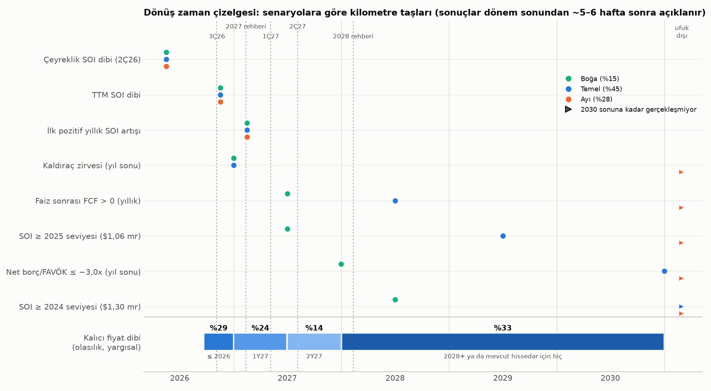
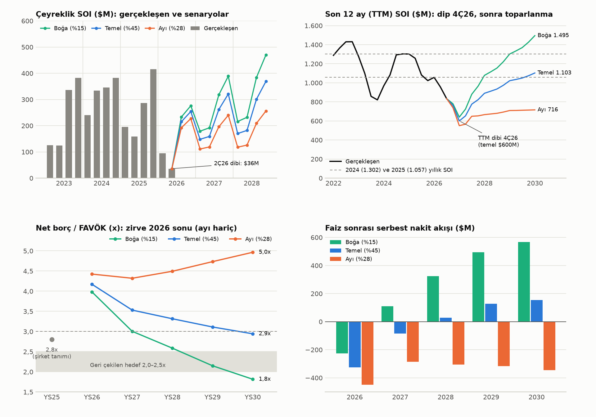
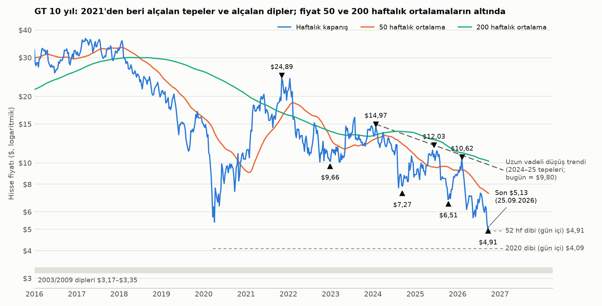
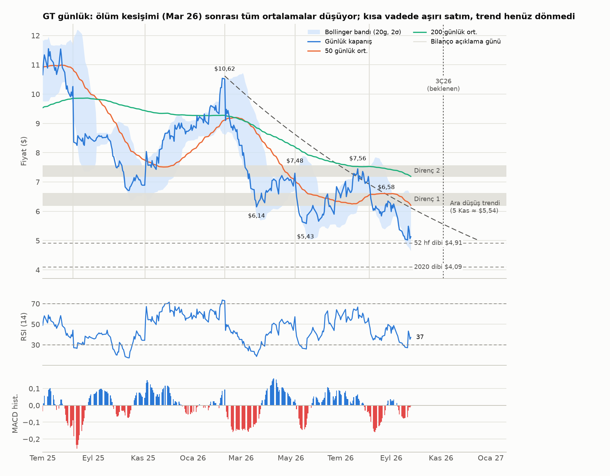
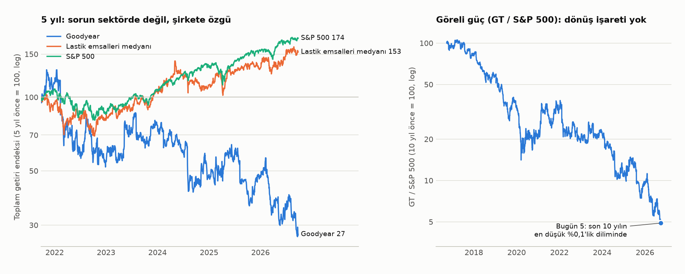
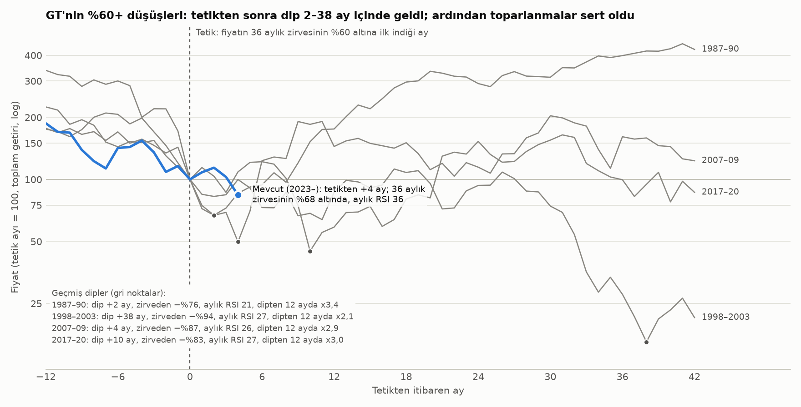
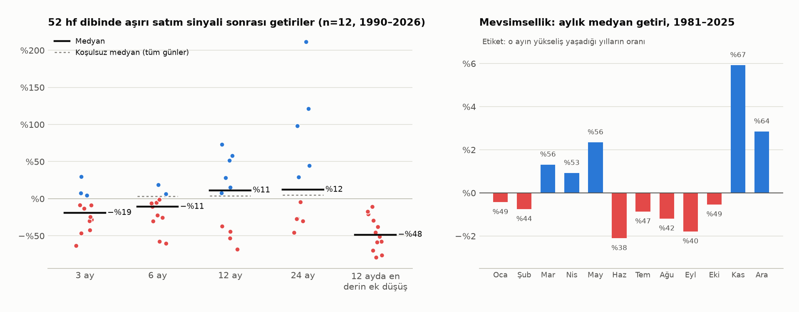

# Goodyear (GT) — Dönüş Analizi: Temel ve Teknik Görünüm, Olası Zamanlama

**Tarih:** 26 Eylül 2026 · **Fiyat:** \$5,13 (25.09.2026 kapanışı) · **Kapsam:** Ana değerleme raporunun ([GT_degerleme_raporu.md](GT_degerleme_raporu.md)) ekidir; senaryolar, olasılıklar ve değerler aynı modelden gelir.

> **Önemli not:** Bu çalışma bir finansal analizdir, kişisel yatırım tavsiyesi değildir; hazırlayan lisanslı yatırım danışmanı değildir. Teknik analiz ve tarihsel taban oranları kesinlik değil olasılık bildirir. Karar, risk toleransı ve pozisyon büyüklüğü size aittir.

## 1. Kısa cevap

"Uzun vadede bir geri dönüş var mı, varsa ne zaman?" sorusu iki ayrı soruya ayrılmalı: **(a) şirketin kârlılığı dipten dönecek mi**, **(b) hisse fiyatı kalıcı olarak dönecek mi.** Birincinin cevabı büyük olasılıkla evet ve takvimi oldukça net; ikincisi için henüz teyit yok.

1. **Operasyonel dip büyük olasılıkla geride kaldı.** Çeyreklik segment faaliyet kârı (SOI) 2Ç26'da \$36 milyonla dibi gördü (bir yıl önce \$159 milyon). Son 12 aylık (TTM) SOI'nin dibi 4Ç26'da oluşacak (temel senaryoda \$600 milyon). **Yıllık bazda ilk pozitif SOI karşılaştırması 1Ç27'de** (Mayıs 2027'de açıklanacak): temelde +%56, ayıda +%17, boğada +%88. Sıkıntı senaryosu dışındaki tüm senaryolarda (toplam olasılık %88) bu dönüş gerçekleşiyor; ancak büyük ölçüde çok düşük bazdan kaynaklanan "mekanik" bir dönüş.

2. **Toparlanmanın boyu kısa.** Temel senaryoda SOI 2025 seviyesine (\$1.057 milyon) ancak 2029'da dönüyor, 2024 seviyesine (\$1.302 milyon) 2035'e kadar dönmüyor. Net borç/FAVÖK 2026 sonunda ≈4,2x ile zirve yapıp 2030'a kadar 3x'in üstünde kalıyor; faiz sonrası serbest nakit akışı ancak 2028'de pozitife dönüyor. Boğa senaryosunda (%15) bunların hepsi 2027–2028'de oluyor; ayı senaryosunda (%28) hiçbiri 2030'a kadar olmuyor.

3. **Teknik olarak dönüş yok.** 2021'den beri alçalan tepeler (\$24,89 → \$14,97 → \$12,03 → \$10,62) ve alçalan dipler (\$9,66 → \$7,27 → \$6,51 → \$4,91) var. Fiyat 20, 50, 100 ve 200 günlük ortalamaların, 50 ve 200 haftalık ortalamaların altında. 50 günlük ortalama 200 günlüğün altına indi (ölüm kesişimi, 10.03.2026). S&P 500'e göre göreli güç son 10 yılın en düşük %0,1'lik diliminde.
   Kısa vadede aşırı satım var: stokastik 17, Bollinger %B 0,26, günlük MACD histogramı sıfıra yaklaşıyor. Bu yüzden **tepki yükselişi** olasıdır. Ancak haftalık momentum hâlâ bozuluyor. Aylık RSI (36) de geçmiş büyük diplerdeki 'teslimiyet' seviyelerine (21–27) inmedi.

4. **Fiyat bu kez kâr dibinin gerisinde kalıyor.** Önceki iki döngüde hisse, kâr dibinin açıklanmasından önce dip yaptı: 2020'de 4,4 ay, 2022–23'te 7,1 ay önce. Bu kez 2Ç26 dibinin açıklanmasından (5 Ağustos) 1,5 ay **sonra** yeni dip yapıldı. Piyasa kâr dibinden çok başka riskleri fiyatlıyor: bilanço (işletme değeri piyasa değerinin ≈5,6 katı), faiz (10 yıllık %5,18) ve hammadde (kauçuk bir yılda +%47, Brent \$104). Analistler 2027 EPS tahminini 90 günde %31 indirdi ve indirmeye devam ediyor.

5. **Zamanlama (olasılık ağırlıklı, yargısal):** Kalıcı fiyat dibinin olasılıkları dönemlere göre şöyle:
   - **2026 sonuna kadar** (Eylül'deki \$4,91 dahil): ≈%29
   - **2027'nin ilk yarısında:** ≈%24
   - **2027'nin ikinci yarısında:** ≈%14
   - **2028 ve sonrasında ya da mevcut hissedar için hiç:** ≈%33

   Birikimli olarak 2027 ortasına kadar ≈%53, 2027 sonuna kadar ≈%67. **En olası pencere Kasım 2026 – Mayıs 2027:** 3Ç26 sonuçları, Şubat 2027'deki 2027 rehberi ve 1Ç27'deki ilk pozitif yıllık karşılaştırma.

6. **Teknik teyit en erken 1Ç27'de gelebilir.** Beklenen sıra şöyle:
   - \$4,91 seviyesinin üstünde daha yüksek bir dip oluşması;
   - haftalık kapanışın \$6,20–\$6,61 direncinin üstüne çıkması (ilk 'daha yüksek tepe');
   - fiyatın 200 günlük ortalamanın üstüne çıkması (fiyat yatay kalsa bile bu ortalama Şubat 2027'de ≈\$5,67, Mayıs 2027'de ≈\$5,30 düzeyine iner);
   - 50/200 günlük altın kesişim.

   Temel senaryoda bu dizinin tamamlanması en erken 2027 ortasını bulur.

7. **Değerle bağlantı:** Temel senaryoda içsel değer SAMK %9,25'te \$2,00, %8,25'te \$5,25. Olasılık ağırlıklı değer \$3,96. Yani **operasyonel toparlanma tek başına bugünkü fiyatın üzerinde bir değer anlamına gelmiyor.** Kalıcı bir hisse dönüşü iki yoldan biriyle gelir: ya boğa senaryosuna kayış (Fayetteville ve EMEA tasarruflarının net kâra yansıdığının kanıtı) ya da faizlerde belirgin düşüş. Öte yandan GT'nin geçmiş büyük diplerinden sonraki toparlanmalar çok sert oldu: 12 ayda x2,1–x3,4. Bu yüzden asimetri iki yönde de çok geniş.

## 2. Temel analiz: döngünün neresindeyiz?

### 2.1 Kâr döngüsü: çeyreklik SOI

Gerçekleşenler 8-K kazanç bültenlerinden alındı. 2026/2Y tahminleri yönetimin 2Ç26 köprüsüne, 2027 tahminleri ise değerleme modelinin yıllık senaryo SOI'sine dayanıyor. Yıllık tutar, 2023–2025 ortalama mevsimsel paylarla çeyreklere bölündü: 1Ç %16,6, 2Ç %17,8, 3Ç %29,5, 4Ç %36,1.

| Çeyrek | Gerçekleşen / Temel | Boğa | Ayı | Temel: yıllık değişim |
|---|---|---|---|---|
| 1Ç25 | **195** |  |  | −%19 |
| 2Ç25 | **159** |  |  | −%52 |
| 3Ç25 | **287** |  |  | −%17 |
| 4Ç25 | **416** |  |  | +%9 |
| 1Ç26 | **95** |  |  | −%51 |
| 2Ç26 | **36** |  |  | −%77 |
| 3Ç26 (T) | 215 | 233 | 192 | −%25 |
| 4Ç26 (T) | 254 | 276 | 227 | −%39 |
| 1Ç27 (T) | 148 | 179 | 111 | +%56 |
| 2Ç27 (T) | 159 | 192 | 119 | +%342 |
| 3Ç27 (T) | 262 | 318 | 196 | +%22 |
| 4Ç27 (T) | 321 | 389 | 240 | +%26 |

*Milyon \$. (T) = tahmin. 2026 toplamı: boğa 640, temel 600, ayı 550. 2027 toplamı: boğa 1.078, temel 890, ayı 666.*

**3Ç26 köprüsü (yönetimin 2Ç26 sunumu ve 10-Q'su):** 3Ç25 \$287M + Goodyear Forward \$70M + fiyat/karma \$110M − hammadde \$20M − eksik kapasite kullanımı \$70M − enflasyon \$95M − tarifeler \$10M − satılan işler \$57M ≈ **\$215M**. Yıl toplamı için analistlerin yeniden kurgusu \$580–\$620M. 10-Q'ya göre yönetim 3Ç26'da hammaddenin yalnızca ≈\$20 milyon olumsuz etki yapmasını bekliyor. Stoklar ilk giren ilk çıkar (FIFO) ya da ortalama maliyetle değerlendiği için spot fiyat artışları maliyete gecikmeyle yansır. Bu nedenle kauçuk ve petroldeki son yükselişin asıl etkisinin 4Ç26 ve 2027'nin ilk yarısında görülmesini bekliyoruz (bizim çıkarımımız; yönetim henüz 2027 hammadde rehberi vermedi). Ayı senaryosundaki daha düşük 2026 tahmini bu riski yansıtıyor.

### 2.2 Bilanço ve nakit: kaldıraç zirvesi, nakit dönüşü, vadeler

| | Boğa | Temel | Ayı |
|---|---|---|---|
| Net borç/FAVÖK, 2026 sonu | 4,0x | 4,2x | 4,4x |
| Net borç/FAVÖK, 2027 sonu | 3,0x | 3,5x | 4,3x |
| Net borç/FAVÖK, 2028 sonu | 2,6x | 3,3x | 4,5x |
| Faiz sonrası FCF 2026 / 2027 / 2028 (milyon \$) | −225 / 110 / 323 | −325 / −85 / 28 | −450 / −286 / −305 |
| İlk pozitif faiz sonrası FCF yılı | 2027 | 2028 | 2035'e kadar yok |
| Net borç/FAVÖK ≤ ≈3,0x (ilk yıl sonu) | 2027 (3,00x) | 2030 | yok (2035'te 6,1x) |

*FAVÖK = SOI − kurumsal giderler + amortisman (modelle aynı tanım). 2025 sonu şirket tanımıyla 2,8x, Haziran 2026 son 12 ay 3,8x idi.*

**Vade takvimi (10-Q, 30.06.2026, nominal):**

| Yıl | Tutar (milyon \$) | Kalem | Not |
|---|---|---|---|
| 2027 | 819 | %4,875 ve %7,625 tahviller | Haziran 2026'daki 1,05 milyar dolarlık %8,875 kuponlu 2032 tahvili ile geri ödenecek (ön fonlanmış) |
| 2028 | 606 | %7 tahvil ve %2,75 Euro tahvil | Avrupa revolveri Ocak 2028'de doluyor (800 milyon avro limit, 205 milyon dolar kullanılmış) |
| 2029 | 850 | %5 tahvil |  |
| 2030 | 500 | %6,625 tahvil | ABD birinci derece teminatlı revolver de 2030'da doluyor (157 milyon dolar kullanılmış) |
| 2031 | 1.150 | %5,25 tahviller (Nisan ve Temmuz) |  |
| 2032 | 1.050 | %8,875 tahvil | Haziran 2026 ihracı |
| 2033 | 450 | %5,625 tahvil |  |

Avrupa alacak finansmanı programının yedek likidite taahhütleri Ekim 2027'de sona eriyor. 30.06.2026'da kullanılabilir likidite ≈\$3,9 milyar, nakit \$0,86 milyar.

**Zamanlama açısından anlamı:** 2027 vadeleri Haziran 2026 tahvil ihracıyla önceden fonlandı. 2028'den önce bir likidite uçurumu yok. Bu nedenle ayı ve sıkıntı yolları ani bir olay olarak değil, **yavaş bir aşınma** olarak işler. Sıkıntı olasılığı asıl 2028–2029 refinansmanında kristalleşir. Bu da aşağı yönlü senaryolarda fiyat dibinin 2028 ve sonrasına kayması beklentisinin gerekçesidir.

**Özsermaye kaldıracı:** Piyasa değeri ≈\$1,49 milyar, özsermaye önündeki talepler (net borç, emeklilik açığı, asbest, azınlık payı) \$6,91 milyar; işletme değeri piyasa değerinin ≈5,6 katı. Buna göre işletme değerindeki %1'lik değişim özsermayeyi ≈%5,6 oynatıyor. Faizlerdeki yükselişin ve küçük marj revizyonlarının hisseyi bu kadar sert etkilemesinin nedeni bu. SAMK'daki her 100 baz puanlık değişim, senaryo ağırlıklı değeri hisse başına ≈\$1,60–\$2,39 değiştiriyor.

### 2.3 Sektör ve makro öncü göstergeler

| Gösterge | Son veri | GT için anlamı |
|---|---|---|
| ABD lastik sevkiyatları 2026T (USTMA, 6 Ağustos 2026) | Toplam 330,3 milyon (−%1,8). Yedek: binek 218,3M (−%1,6), hafif kamyon 37,1M (−%1,6), kamyon 22,9M (−%7,1). OE: binek 41,0M (−%0,7), kamyon 4,6M (+%6,2) | Yedek pazar 2026'da da küçülüyor. GT'nin Amerika yedek hacmindeki düşüş (1Y26: −%18) sektörün çok üzerinde, yani sorun büyük ölçüde pay kaybı. Sektör dönüşü tek başına yetmez. |
| ABD Class 8 kamyon siparişleri, Ağustos 2026 (ACT / FTR) | ACT 16.800 (y/y +%31, a/a −%25,5); FTR 18.200 (y/y +%42; yılbaşından beri +%111) | Ticari OE talebi güçlü. FTR'ye göre Ağustos, EPA 2027 NOx kuralı öncesi öne çekilen alımların fiilen sonu; 2027'de OE'de ön alım sonrası boşluk riski var. Ticari yedek pazar (−%7,1) hâlâ zayıf. |
| Doğal kauçuk vadeli (Trading Economics, 25.09.2026) | 254 ABD senti/kg; 1 ayda +%8, 1 yılda +%46,7; 2013 başından beri en yüksek | Hammadde enflasyonu geri döndü. 4Ç26 ve 1Y27 marjları için risk; fiyat artışlarıyla telafi edilip edilemeyeceği Şubat 2027 rehberinin ana sorusu. |
| Brent petrol (Yahoo, BZ=F) | \$104,32; 3 ayda +%45, 1 yılda +%51; 12 ay zirvesi \$118,35 (31.03.2026) | Sentetik kauçuk, karbon siyahı, enerji ve navlun maliyetleri. Aynı zamanda tüketici talebi için olumsuz. |
| ABD 10 yıllık tahvil faizi (^TNX) | %5,18; 3 ayda +0,81 puan, 1 yılda +1,04 puan | Yüksek kaldıraçlı özsermaye için en güçlü değerleme baskısı. Faizler %4,5'e inerse SAMK ≈%8,55'e, senaryo DCF'si ≈\$5,2'ye çıkar. |

### 2.4 Beklentiler ve konumlanma

- **Analist tahminleri hâlâ düşüyor.** 2027 EPS \$0,53 (90 gün önce \$0,77, −%31); 4Ç26 EPS \$0,23 (90 gün önce \$0,35, −%36); 2026 EPS −\$0,69 (90 gün önce −\$0,45). Son 30 günde 2027 için 4 indirim, 2 artırım var. Döngüsel hisselerde dip çoğu zaman tahmin indirimlerinin yavaşlayıp durduğu noktada oluşur (genel gözlem); revizyon yönü dönmeden fiyat dibi teyidi zor.

- **Hedef fiyatlar:** ortalama \$7,46 (\$6–\$10), 7 analist, ortalama öneri 'tut'. 2027 EPS konsensüsü ≈\$1,05 milyar SOI'ye denk geliyor; bu, temel senaryomuzun (\$890M) üzerinde.

- **Açığa satış:** 48,9 milyon hisse (15.09.2026); bir ayda +%20. Halka açık pay içindeki oranı %21,7, kapatılması ≈4,9 günlük işlem hacmi gerektiriyor. Olumlu bir sürprizde yükselişi sertleştirebilir: 3Ç bilançolarının ardından Kasım 2024'te +%35 (zirve 02.12.2024), Kasım 2025'te +%53 (zirve 06.02.2026) yükseliş görüldü. İkisi de kalıcı olmadı: ilki 13.02.2025'e kadar neredeyse tamamen geri verildi (\$8,17), ikincisi 13.03.2026 itibarıyla başlangıç seviyesinin altına indi.

- **Aktif kurumsallar azaltıyor (Schedule 13G/A):** Wellington %6,9 → %5,3, AQR %6,28 → %4,47 (Mayıs → Ağustos 2026 bildirimleri).

- **İçeriden alım yok:** 2026'da hiç açık piyasa alımı olmadı. Haziran 2025'ten beri tek alım bir yönetim kurulu üyesine ait (Kasım 2025, 100 bin hisse, \$7,55). Yöneticilerin toplu açık piyasa alımları dip teyidi olarak izlenen bir göstergedir; şu an sessiz.

### 2.5 Temel sonuç: senaryolara göre kilometre taşları

| Kilometre taşı | Boğa (%15) | Temel (%45) | Ayı (%28) |
|---|---|---|---|
| Çeyreklik SOI dibi | 2Ç26 (\$36M) — muhtemelen geride | 2Ç26 (\$36M) — muhtemelen geride | 2Ç26 (\$36M) — muhtemelen geride |
| TTM SOI dibi | 4Ç26 (\$640M; Şubat 2027'de açıklanır) | 4Ç26 (\$600M; Şubat 2027'de açıklanır) | 4Ç26 (\$550M; Şubat 2027'de açıklanır) |
| İlk pozitif yıllık SOI karşılaştırması | 1Ç27 (Mayıs 2027'de açıklanır) | 1Ç27 (Mayıs 2027'de açıklanır) | 1Ç27 (Mayıs 2027'de açıklanır) |
| Kaldıraç zirvesi | 2026 sonu (4,0x) | 2026 sonu (4,2x) | zirve yok; 2030'da 5,0x |
| Faiz sonrası FCF > 0 | 2027 | 2028 | ufukta yok |
| SOI ≥ 2025 seviyesi (\$1,06 milyar) | 2027 | 2029 | ufukta yok |
| Net borç/FAVÖK ≤ ≈3,0x | 2027 sonu | 2030 sonu | ufukta yok |
| SOI ≥ 2024 seviyesi (\$1,30 milyar) | 2028 | ufukta yok | ufukta yok |

**Temel sonuç:** Kâr döngüsünün dönüşü neredeyse kesin ve takvimi belli: dip 2Ç26, ilk büyüme 1Ç27. Asıl belirsizlik **toparlanmanın boyu**. Boğa ile temel arasındaki fark, 2028'de ≈\$280 milyon SOI. Bu fark, büyük ölçüde Fayetteville (+\$270M/yıl) ve EMEA (+\$50M/yıl) tasarruflarının ne kadarının net kâra kalacağına bağlı. Bunu ilk kez somut olarak gösterecek belge Şubat 2027 rehberi, ikincisi 2027 boyunca çeyreklik SOI köprüleri.

## 3. Teknik analiz

### 3.1 Uzun vadeli trend

Fiyat tüm zamanların zirvesinin (\$76,75, 1998) %93 altında. 2021–22 zirvesinin ise %79 altında. 50 haftalık ortalama \$7,28 (−%30), 200 haftalık ortalama \$10,19 (−%50). 2024 ve 2025 tepelerinden geçen uzun vadeli düşüş trendi bugün ≈\$9,80 düzeyinde ve yılda ≈%15 alçalıyor (15.02.2027'de ≈\$9,21). Yapı, 2021'den beri her toparlanmanın (%50–80) bir öncekinden daha aşağıda tükendiği klasik bir ayı piyasası. Uzun vadeli trendin döndüğünü söylemek için bu çizginin ve 200 haftalık ortalamanın geri alınması gerekir. Temel senaryoda bu 2027 içinde gerçekçi değil; ancak boğa senaryosunda 2027–2028'de mümkün.

### 3.2 Orta ve kısa vade: momentum

| Gösterge | Değer | Yorum |
|---|---|---|
| Fiyat / 20-50-100-200 günlük ort. | \$5,58 / \$6,20 / \$6,23 / \$7,19 | Fiyat sırasıyla −%8, −%17, −%18, −%29 uzakta; ortalamalar ayı dizilişinde |
| 200 / 50 günlük ort. eğimi (1 ay) | −%3,5 / −%5,9 | İkisi de düşüyor |
| RSI(14) günlük / haftalık / aylık | 37 / 35 / 36 | Zayıf ama 30'un üstünde; büyük diplerde aylık RSI 21–27 idi |
| MACD histogramı günlük / haftalık / aylık | −0,007 (5 gün önce −0,075) / −0,096 (4 hafta önce 0,039) / −0,158 | Günlükte yukarı kesişim eşiğinde; haftalıkta yeni bozulma; aylık negatif |
| ADX(14) günlük / haftalık | 24,7 (−DI 29,1 > +DI 17,2) / 20,3 (−DI 28,5 > +DI 14,3) | Orta güçte düşüş trendi |
| Stokastik %K / %D | 17 / 19 | Kısa vadeli aşırı satım |
| Bollinger (20g, 2σ) | alt \$4,65 · orta \$5,58 · üst \$6,52; %B 0,26 | Alt banda yakın |
| ATR(14) / oynaklık | \$0,26 (fiyatın %5,1'i); 20 günlük yıllık %56, 1 yıllık %47 | Oynaklık yükseliyor |
| Getiriler | 1 ay −%18 · 3 ay −%25 · YBB −%41 · 1 yıl −%37 · 3 yıl −%60 · 5 yıl −%70 · 10 yıl −%84 | |

### 3.3 Destek ve direnç haritası

| Seviye | Dayanak | Fiyata uzaklık |
|---|---|---|
| \$10,62 | 52 haftalık zirve (09.02.2026) | +%107 |
| \$9,80 | Uzun vadeli düşüş trendi (2024–25 tepeleri; bugünkü değer, alçalıyor) | +%91 |
| \$8,30–\$8,90 | Son 2 yılın en yoğun hacim düğümleri; Fibonacci %50 (\$8,47) | +%68 |
| \$7,63 | Fibonacci %38,2 (2025 zirvesi → 52 hf dibi) | +%49 |
| \$7,19–\$7,56 | 200 günlük ort., Temmuz tepesi (\$7,56), hacim düğümü (\$7,18) | +%44 |
| \$6,20–\$6,61 | 50/100 günlük ort., Ağustos tepesi (\$6,58), Fibonacci %23,6 (\$6,59), hacim düğümü (\$6,61) — **ilk kritik direnç** | +%25 |
| \$6,12 | Şubat–Ağustos 2026 ara düşüş trendi (5 Kasım'da ≈\$5,54) | +%19 |
| \$5,58 | 20 günlük ort. / Bollinger orta bandı | +%9 |
| \$4,91 | 52 haftalık dip (21.09.2026) — **ilk kritik destek** | −%4 |
| \$4,65 | Bollinger alt bandı | −%9 |
| \$4,09 | 2020 COVID dibi | −%20 |
| \$3,17–\$3,35 | 2009 ve 2003 dipleri (çok yıllık taban) | −%36 |

*Fiyat: \$5,13.*

### 3.4 Göreli güç: sorun şirkete özgü

Son bir yılda GT toplam getiri bazında −%35, dokuz lastik emsalinin medyanı +%17 (dokuz emsalin 8 tanesi pozitif). Üç yılda GT −%58, emsal medyanı +%58. S&P 500'e göre göreli performans 1 yılda −%46, 3 yılda −%77, 5 yılda −%83. Yani sektör düşüşte değil; emsaller çoğunlukla 200 günlük ortalamalarının üstünde. GT'nin toparlanması için sektör döngüsünü beklemek yetmez. Şirkete özgü kanıt gerekir: pay kaybının durması, tasarrufların kâra yansıması ve bilanço. Emsallere göre göreli gücün dönmesi, piyasanın bu kanıtı kabul ettiğinin en erken işareti olur.

### 3.5 Hacim ve konumlanma

Dengeli hacim (OBV) son 3 ayda ortalama günlük hacmin 7,2 katı kadar düştü; bu, dağıtım anlamına gelir. Yükselen ve düşen günlerin hacim oranı 0,99. 3 aylık ortalama hacim 9,9 milyon, 1 yıllık ortalama 8,4 milyon. Hacim artarken fiyatın düşmesi, satıcıların hâlâ baskın olduğunu gösteriyor. Bir dip genellikle ya çok yüksek hacimli bir teslimiyet günüyle ya da düşük hacimli bir taban oluşumunun ardından yükselen hacimle gelir; şu an ikisi de yok. Açığa satışın yüksekliği (%21,7) ise olası bir dönüşün ilk ayağını sertleştirebilir.

### 3.6 Düşen çıta: 200 günlük ortalama

Fiyat \$5,13'te yatay kalsa bile 200 günlük ortalama hızla alçalır: 5 Kasım 2026'da ≈\$6,64, 15 Şubat 2027'de ≈\$5,67, 6 Mayıs 2027'de ≈\$5,30. Bu yüzden 4–7 aylık bir taban oluşumu, fiyatı 2Ç27 civarında kendiliğinden 200 günlük ortalamanın üstüne taşır. Bu eşik, temel takvimle (Şubat rehberi ve Mayıs'taki 1Ç27 sonuçları) çakışan doğal bir kontrol noktasıdır. Ara düşüş trendi daha da hızlı alçalıyor (15 Şubat 2027'de ≈\$4,33); onun yatay seyirle kırılması zayıf bir kanıt olur. Asıl önemli sinyal, \$6,58 Ağustos tepesinin üstünde bir 'daha yüksek tepe'dir.

## 4. Tarihsel taban oranları

### 4.1 GT'nin %60+ düşüşleri

Tanım: aylık toplam getiri fiyatının 36 aylık zirvesinin %60 altına ilk indiği ay 'tetik' kabul edildi. Dönem, fiyat bu zirvenin yarısını geri alınca bitiyor.

| Dönem | Zirve | Tetik | Dip | Tetikten dibe | Zirveden derinlik | Aylık RSI (dip) | Dipten 12 ay | Dipten x2 |
|---|---|---|---|---|---|---|---|---|
| 1987–90 | 1987-09 | 1990-08 | 1990-10 | 2 ay | −%76 | 21 | +%242 | 8 ay |
| 1998–2003 | 1998-03 | 1999-12 | 2003-02 | 38 ay | −%94 | 27 | +%111 | 11 ay |
| 2007–09 | 2007-05 | 2008-10 | 2009-02 | 4 ay | −%87 | 26 | +%193 | 2 ay |
| 2017–20 | 2017-04 | 2019-05 | 2020-03 | 10 ay | −%83 | 27 | +%202 | 11 ay |
| 2021–24 (ara) | 2021-12 | 2024-10 | 2024-10 | 0 ay | −%62 | 38 | −%14 | – |
| Mevcut | 2023-07 | 2026-05 | 2026-09 (şimdilik) | 4+ ay | −%68 | 36 | – | – |

**Okuma:** Dört büyük dönemin üçünde son dip tetikten 2–10 ay sonra geldi. Mevcut tetik Mayıs 2026'da oluştu; bu, Temmuz 2026 – Mart 2027 aralığına denk geliyor ve şu an bu aralığın içindeyiz. Dördüncü dönem (1998–2003, şirketin iflasın eşiğine geldiği yıllar) 38 ay sürdü; bugünün ayı ve sıkıntı senaryolarının karşılığı bu.
Büyük diplerde derinlik zirveden −%76 ile −%94 arasındaydı ve aylık RSI 21–27'ye inmişti. Bugün derinlik −%68, RSI 36. Kısa süren üç büyük dönemin derinlikleri bugüne uygulanırsa ≈\$2,01–\$3,85 bölgesi çıkıyor; 1998–2003'ün derinliği ise ≈\$1,01 demek. Bu bölge 2003/2009 diplerini (\$3,17–\$3,35) içine alıyor; 2020 dibi (\$4,09) bölgenin hemen üstünde.
Bu bir fiyat hedefi değil. Önceki büyük diplerin hepsi makro krizlerle (1990 resesyonu, 2001–03, 2008–09, COVID) çakıştı; bugünkü düşüş ise şirkete özgü ve piyasa zirvede. Yine de 'teslimiyet' işaretlerinin henüz görülmediğini gösteriyor. 2021–24 ara dönemi de uyarıcı: Ekim 2024'teki ilk dip kalıcı olmadı (12 ay sonra −%14).

### 4.2 Aşırı satım sinyalleri sonrası getiriler

Sinyal tanımı: kapanış 52 haftalık dibin %2 yakınında, 3 yıllık zirvenin en az %55 altında ve haftalık RSI 35'in altında (her 6 ayda ilk sinyal). 1990–2026 arasında 12 sinyal oluştu; sonuncusu 15.05.2026 tarihinde. Bugünkü durum da bu tanıma uyuyor.

| Ufuk | Medyan | Pozitif oranı | En kötü | En iyi | Koşulsuz medyan (tüm günler) |
|---|---|---|---|---|---|
| 3 ay (n=12) | −%19 | %25 | −%64 | +%29 | – |
| 6 ay (n=11) | −%11 | %18 | −%60 | +%18 | +%3,3 |
| 12 ay (n=10) | +%11 | %60 | −%68 | +%73 | +%3,8 |
| 24 ay (n=10) | +%12 | %50 | −%46 | +%211 | +%5,1 |
| 12 ay içinde en derin ek düşüş | −%48 | – | −%79 | −%11 | – |

**Okuma:** GT'yi aşırı satılmış 52 haftalık diplerde almak, tarihsel olarak önce 3–6 ay para kaybettirdi. 12 aylık sonuç ise yazı-tura oldu ama sağa çarpıktı. Sinyalden sonraki dip medyan ≈4 ay sonra geldi (12 aylık penceresi tamamlanmış 10 sinyal). Son üç sinyalin (Ağustos 2024, Ekim 2025, Mayıs 2026) ardından 12 ay içinde sırasıyla −%18, −%30 ve −%11 ek düşüş yaşandı; hiçbiri kalıcı dip olmadı. Küçük örneklem (n=12) ve üç sinyalin makro krizlerden (2002, 2008, 2019→COVID) hemen önce gelmesi medyanı kötüleştiriyor. Yine de ders açık: **aşırı satım tek başına dip sinyali değildir; GT için teyit beklemenin tarihsel maliyeti düşük oldu.**

### 4.3 Fiyat dibi ile kâr dibi arasındaki ilişki

| Döngü | Fiyat dibi | Kâr (SOI) dibi | Kâr dibinin açıklanması | Fiyat, açıklamaya göre |
|---|---|---|---|---|
| 2020 (COVID) | 19.03.2020 (\$4,09) | 2Ç20 (−\$431M) | 31.07.2020 | 4,4 ay önce |
| 2022-23 (enflasyon/stok) | 28.12.2022 (\$9,66) | 2Ç23 (\$124M) | 02.08.2023 | 7,1 ay önce |
| 2026 (mevcut) | 21.09.2026 (\$4,91) | 2Ç26 (\$36M) | 05.08.2026 | 1,5 ay sonra (düşüş sürüyor) |

**Okuma:** Önceki iki döngüde hisse, kâr dibinin açıklanmasından 4–7 ay önce dip yaptı. Bu kez kâr dibi açıklandıktan sonra da fiyat düşmeye devam ediyor. Bu, piyasanın (i) 2Ç26'nın dip olduğuna inanmadığını (hammadde ve petrol yükselişi, tarifeler), ya da (ii) kâr dibinden bağımsız olarak özsermayenin değerini sorguladığını gösteriyor: kaldıraç, faiz ve kalıcı pay kaybı riski. İkinci okuma doğruysa dip, kâr döngüsünden çok bilanço ve rehberlik haberlerine bağlı olacak. Bu da Şubat 2027 rehberini (2027 SOI ve FCF) en önemli katalizör yapıyor.

### 4.4 Mevsimsellik ve bilanço tepkileri

- **Mevsimsellik (1981–2025):** En güçlü aylar Kasım (medyan +%5,9; yükselen yıl oranı %67), Aralık (medyan +%2,8; yükselen yıl oranı %64); en zayıf aylar Haziran (medyan −%2,1; %38), Eylül (medyan −%1,8; %40). Kasım başındaki 3Ç açıklaması en güçlü mevsimsel pencereyle çakışıyor. Buna karşın yılbaşından beri %41'lik kayıp, yıl sonuna doğru vergi amaçlı satış baskısı yaratabilir.

- **Bilanço günü tepkileri (son 13 açıklama):** 3Ç sonuçları (Kasım) son üç yılda hep olumlu karşılandı: 2023 +%3,0 (20 günde +%12,5), 2024 +%13,7 (20 günde +%32,3), 2025 +%7,8 (20 günde +%26,6). 2Ç sonuçları (Temmuz sonu/Ağustos başı) ise 4 yılın hepsinde olumsuz karşılandı: 2023 −%16,2, 2024 −%15,9, 2025 −%18,5, 2026 −%2,6. Örneklem çok küçük; ama Kasım başındaki açıklamanın geçmişte bir 'tepki yükselişi' tetikleyicisi olduğunu gösteriyor. Kalıcı dönüşü ise göstermiyor: 2024 ve 2025'teki Kasım rallileri birkaç ay içinde geri verildi (bkz. 2.4).

## 5. Sentez: dönüş ne zaman ve hangi koşulda?

### 5.1 Senaryo haritası

| Senaryo | Olasılık | Temel hikâye | Fiyat dibi | Teknik yol | İçsel değer (SAMK %9,25 / %8,25) |
|---|---|---|---|---|---|
| Boğa | %15 | 3Ç26 SOI ≥ \$230M; 2027 rehberi ≥ \$1,0 milyar SOI ve pozitif FCF; Fayetteville tasarrufu çeyreklik köprülerde görünür; kaldıraç 2027 sonunda ≈3,0x | Eylül 2026 (\$4,91) ya da Kasım 2026 | 1Ç27'de \$6,61 üstü haftalık kapanış; 1Y27'de 200 günlük ort. üstü ve altın kesişim; 2027 içinde \$8,30–\$9,80 bölgesinin testi | \$17,05 / \$23,22 |
| Temel | %45 | 2026 SOI ≈\$600M; 2027 ≈\$890M (%5 marj); hammadde fiyatla kısmen telafi; kaldıraç 2027 sonunda 3,5x | 4Ç26 – 2Ç27 arası; muhtemelen \$4,09–\$4,91 bölgesinin yeniden testiyle | 2027 boyunca \$4–\$7 bandında dalgalı taban; 200 günlük ort. üstü en erken 2Ç27; kalıcı trend dönüşü 2Y27 | \$2,00 / \$5,25 |
| Ayı | %28 | Marj ≈%4'te takılır; tasarruflar enflasyonda erir; faiz sonrası FCF negatif; kaldıraç yükselir | 2028 ve sonrası | \$4,91 kırılır; \$4,09 ve \$3,17–\$3,35 test edilir; alçalan tepeler sürer | \$0,00 / \$0,00 |
| Sıkıntı | %12 | 2028–29 vadeleri öncesi refinansman sorunu; sulandırıcı sermaye artırımı ya da borç-hisse takası | Mevcut hissedar için anlamsız | Kalıcı düşüş | \$0,20 |

### 5.2 Dip zamanlamasının olasılık eşlemesi

Her senaryo için kalıcı fiyat dibinin hangi dönemde oluşacağına dair yargısal paylar aşağıda. Satırlar senaryo olasılıklarıyla ağırlıklandırılarak toplandı. Paylar tartışmaya açık bir yargıdır; farklı düşünen okur tabloyu kendi paylarıyla yeniden hesaplayabilir (`scripts/turnaround_data.py`).

| Senaryo (olasılık) | 2026 sonuna kadar | 1Y27 | 2Y27 | 2028+ / hiç | Gerekçe |
|---|---|---|---|---|---|
| Boğa (%15) | %90 | %10 | %0 | %0 | Dip Eylül 2026 dibi (4,91 dolar) ya da 3Ç26 sonuçları çevresinde oluşur; güçlü 2027 rehberi teyit eder. |
| Temel (%45) | %35 | %50 | %15 | %0 | Hammadde/petrol ve rehberlik belirsizliği 1Y27'ye taşar; dip çoğunlukla 2027 rehberi (Şubat) ile 1Ç27 (Mayıs) arasında. |
| Ayı (%28) | %0 | %0 | %25 | %75 | Marj ≈%4'te takılır, kaldıraç yükselir; 2000–2003 benzeri uzun düşüş, dip 2028 ve sonrasına kayar. |
| Sıkıntı (%12) | %0 | %0 | %0 | %100 | 2028–29 vadeleri öncesi yeniden yapılandırma; mevcut hissedar için "dip" anlamını yitirir. |
| **Olasılık ağırlıklı** | **%29** | **%24** | **%14** | **%33** | Birikimli: 2027 ortası %53, 2027 sonu %67 |

**Taban oranlarla karşılaştırma:** %60+ düşüş dönemlerinin dördünden üçünde son dip, tetikten sonraki 2–10 ay içinde geldi. Bu, olasılık kütlesinin ≈%75'ini Mart 2027'ye kadar koyar. Bizim eşlememiz 2027 ortasına kadar yalnızca ≈%53 veriyor; bilinçli olarak daha temkinli. Dört gerekçesi var:
   1. Teslimiyet işaretleri yok: aylık RSI 36, oysa büyük diplerde 21–27 idi.
   2. Tahmin revizyonları hâlâ aşağı yönlü.
   3. Fiyat bu kez kâr dibinin gerisinde kalıyor.
   4. Değerleme ayı ve sıkıntı senaryolarına toplam %40 olasılık veriyor.

   Ayı ve sıkıntı olasılıklarını daha düşük gören bir okur için dağılım öne kayar.

### 5.3 Neden "operasyonel dönüş" ile "hisse dönüşü" aynı şey değil?

Hisse, işletme değerinin (≈\$8,4 milyar) üzerindeki ince bir özsermaye dilimi (≈\$1,5 milyar). Bugünkü fiyat zaten boğa senaryosuna ≈%25 olasılık yüklüyor; bizim tahminimiz %15. Ters DCF'ye göre fiyat, uzun vadede ≈%6,7 SOI marjını gerektiriyor; temel senaryo %5–6. Yani hisse için soru, '2027'de kâr artacak mı?' değil (büyük olasılıkla artacak); '**ne kadar** artacak ve bu kalıcı mı?' sorusu. 2027 rehberinin ≈\$1 milyar SOI'nin üstünde gelmesi ve Fayetteville tasarrufunun görünmesi, boğa olasılığını anlamlı biçimde yükseltir. \$800 milyonun altında bir rehber ise ayı senaryosunu güçlendirir. Faizlerin düşmesi (10 yıllık %4,5 → SAMK ≈%8,55) temel senaryoyu bile fiyatın yakınına taşır (senaryo DCF ≈\$5,2). Bu yüzden makro, zamanlamanın ikinci anahtarıdır.

## 6. İzleme panosu: dönüşü teyit edecek ya da çürütecek sinyaller

| # | Sinyal | Şu an | Dönüş teyidi | Olumsuz eşik | Ne zaman |
|---|---|---|---|---|---|
| 1 | 3Ç26 SOI | tahmin ≈\$215M (köprü) | ≥ \$230M ve 4Ç için ≥ \$250M ima | < \$190M | Kasım 2026 başı (tarih henüz açıklanmadı) |
| 2 | 2026 serbest nakit akışı | rehber −\$200 / −\$300M | ≥ −\$200M (üst uç) | < −\$350M ya da revolver kullanımının artması | Şubat 2027 |
| 3 | 2027 SOI rehberi | konsensüs ima ≈\$1,05 milyar; temel \$890M | ≥ \$1,0 milyar ve pozitif FCF | < \$800M | Şubat 2027 |
| 4 | Hammadde yorumu | kauçuk 1 yılda +%47; Brent \$104 | 1Y27 hammadde yükünün fiyatla karşılanması | 1Y27'de > \$150M net hammadde yükü | Kasım 2026 / Şubat 2027 |
| 5 | Amerika yedek hacmi | 1Y26: −%18 | Yıllık düşüşün tek haneye inmesi | Çift haneli düşüşün sürmesi | Her çeyrek |
| 6 | Fayetteville tasarrufu | 2027 hedefi +\$90M | Çeyreklik SOI köprülerinde görünmesi | Enflasyonla erimesi | 2027 boyunca |
| 7 | Analist revizyonları | 2027 EPS 90 günde −%31; 30 günde 4 indirim / 2 artırım | 30 günlük revizyonların yukarı dönmesi | İndirimlerin sürmesi | Sürekli |
| 8 | İçeriden alım | 2026'da yok | Birden fazla yöneticinin açık piyasa alımı | – | Sürekli |
| 9 | Kredi notu | S&P B+ / Moody's B1 | Görünüm iyileşmesi | B / B2'ye indirim | Sürekli |
| 10 | Daha yüksek dip | 52 hf dibi \$4,91 | \$4,91 üstünde yeni dip ve yukarı dönüş | Haftalık kapanış < \$4,91 → \$4,09 → \$3,17–\$3,35 | 4Ç26 |
| 11 | İlk daha yüksek tepe | direnç \$6,20–\$6,61 | Haftalık kapanış > \$6,61 | \$6,20 altında reddedilme | 1Ç27 |
| 12 | 200 günlük ortalama | \$7,19 ve düşüyor (yatay fiyatta Şubat'ta ≈\$5,67) | Fiyatın ortalamanın üstüne çıkıp tutunması; ortalamanın yataylaşması | Ortalamanın altında kalma | 1Y27 |
| 13 | Altın kesişim (50g > 200g) | ölüm kesişimi 10.03.2026 | Altın kesişim | – | En erken 2Y27 |
| 14 | Haftalık MACD | histogram −0,096, bozuluyor | Sinyal çizgisini yukarı kesmesi, ardından sıfır üstü | – | 4Ç26 – 1Ç27 |
| 15 | Aylık RSI | 36 | 30 altından geri dönüş (teslimiyet) ya da 50 üstü | – | – |
| 16 | Emsallere göre göreli güç | 1 yılda GT −%35, emsaller +%17 | 3 aylık göreli getirinin pozitife dönmesi | – | – |
| 17 | Hacim / OBV | OBV 3 ayda −7,2 günlük hacim | Yükselişlerde artan hacim; OBV'de daha yüksek dip | – | – |
| 18 | Açığa satış | %21,7; 1 ayda +%20 | Olumlu haberle hızlı düşüş ve fiyatın tutunması | Artmaya devam | Ayda iki kez |

**Pratik kural:** Sıra önemlidir. Kalıcı bir dönüş için 1–3 numaralı temel sinyallerin olumlu çıkması ve 10–12 numaralı teknik sinyallerin onu izlemesi gerekir. Yalnızca teknik bir sıçrama (örneğin Kasım'da açığa satış kapanışıyla %20–30 yükseliş), 2024 ve 2025'te olduğu gibi, düşüş trendi içinde bir tepki olarak kalabilir.

## 7. Riskler, karşı görüş ve yöntem sınırlamaları

- **Yukarı yönlü sürpriz riski:** Yüksek açığa satış, Kasım mevsimselliği ve olumlu 3Ç tepki geçmişi, temel bir değişiklik olmadan da sert bir ralli üretebilir. Böyle bir hareket \$6,61 üstünde bir 'daha yüksek tepe' üretmez ve 200 günlük ortalamanın üstünde tutunmazsa, teknik olarak düşüş trendi içindeki bir tepki olarak kalır.

- **Aşağı yönlü riskler:** Hammadde ve petrol yükselişi; tarifeler ve ithalat rekabetiyle süren pay kaybı; yüksek faiz; EPA 2027 öncesi ön alımların bitmesiyle 2027'de ticari OE'de boşluk; kredi notu indirimi; CFO boşluğu (Temmuz 2026'dan beri geçici CFO).

- **Opsiyonellik:** Varlık satışı ya da birleşme/devralma gibi kontrol değeri olayları modellenmedi; emsal işlemler ana raporda referans olarak var.

- **Yöntem sınırlamaları:** Taban oranlarının örneklemi küçük (4 büyük dönem, 12 sinyal). Çeyreklik dağılım geçmiş mevsimselliğe dayanıyor. Dip zamanlaması eşlemesi yargısal. Teknik analiz olasılık bildirir. Tüm fiyat verileri 25.09.2026 kapanışına, analist verileri 26.09.2026 erişimine aittir.

## 8. Yöntem notları, dosyalar ve kaynaklar

**Veri ve hesaplama:**

- *Fiyat verileri:* Yahoo Finance günlük OHLCV (GT ve S&P 500 için 1980–2026; emsaller, Brent ve 10 yıllık faiz için 5 yıl). Seviyeler bölünmeye göre düzeltilmiş kapanışlarla, getiriler temettü dahil düzeltilmiş kapanışlarla hesaplandı.

- *Göstergeler:* RSI (Wilder, 14), MACD (12-26-9), ADX (14), stokastik (14/3), Bollinger (20, 2σ), OBV.

- *SOI gerçekleşenleri:* 2019–2026 8-K kazanç bültenleri. 2023 ilk açıklandığı haliyle (yıllık 968; 2025 10-K'sı yılı 943'e düzeltti, çeyrek dağılımı yok); 2024 yeniden düzenlenmiş haliyle (1.302).

- *Senaryo yolları:* Değerleme motorunun yıllık SOI'si, 2023–2025 mevsimsel paylarıyla çeyreklere bölündü. Kaldıraç ve faiz sonrası FCF, motorun kaldıraç yolundan alındı.

**Betikler:** `scripts/technical_analysis.py` → `data/technical.json`; `scripts/turnaround_data.py` → `data/turnaround.json`; `scripts/turnaround_charts.py` → grafikler; `scripts/build_turnaround_report.py` → bu rapor. Tamamı `run_all.sh` içinde.

**Doğrulanamayanlar:**

- 3Ç26 açıklama tarihi henüz ilan edilmedi; 2023–2025'te 6, 4 ve 3 Kasım'dı.

- Hammadde maliyetlerinin gecikmeli yansıması, stok muhasebesine dayanan bir çıkarımdır; yönetimin açık bir 2027 hammadde rehberi yok.

- S&P not indiriminin tarihi doğrulanamadı (ana rapor).

**Kaynaklar (erişim 26.09.2026):**

- SEC EDGAR, Goodyear (CIK 42582): 8-K kazanç bültenleri 2020–2026, [10-Q 2Ç26](https://www.sec.gov/cgi-bin/browse-edgar?action=getcompany&CIK=0000042582&type=10-Q), Schedule 13G/A bildirimleri (Wellington, AQR; Mayıs ve Ağustos 2026).
- [USTMA – July 2026 forecast (6 Ağustos 2026)](https://www.ustires.org/newsroom/ustma-july-2026-forecast)
- [Transport Topics – August 2026 Class 8 orders (3 Eylül 2026)](https://www.ttnews.com/articles/class-8-orders-august-2026) · [Fleet Equipment – August 2026 Class 8 orders (ACT)](https://www.fleetequipmentmag.com/august-2026-class-8-orders-act/)
- [Trading Economics – Rubber futures](https://tradingeconomics.com/commodity/rubber)
- [Goodyear – Q3 2025 sonuç duyurusu (açıklama tarihi örüntüsü)](https://news.goodyear.com/2025-10-28-GOODYEAR-TO-ANNOUNCE-THIRD-QUARTER-2025-FINANCIAL-RESULTS)
- Yahoo Finance: fiyat serileri, analist tahmin eğilimleri (earningsTrend), açığa satış ve hedef fiyatlar.

---
*Bu rapor yalnızca bilgilendirme amaçlı bir analizdir; herhangi bir menkul kıymeti alma veya satma tavsiyesi değildir. Geçmiş performans gelecekteki sonuçların göstergesi değildir. Hazırlayan lisanslı yatırım danışmanı değildir.*
