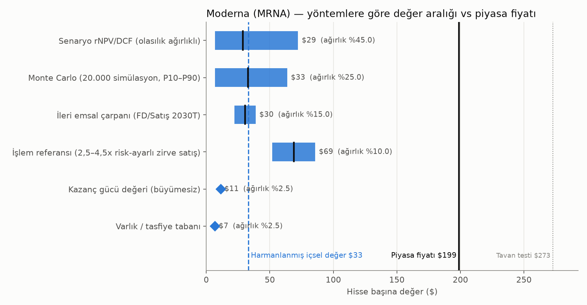
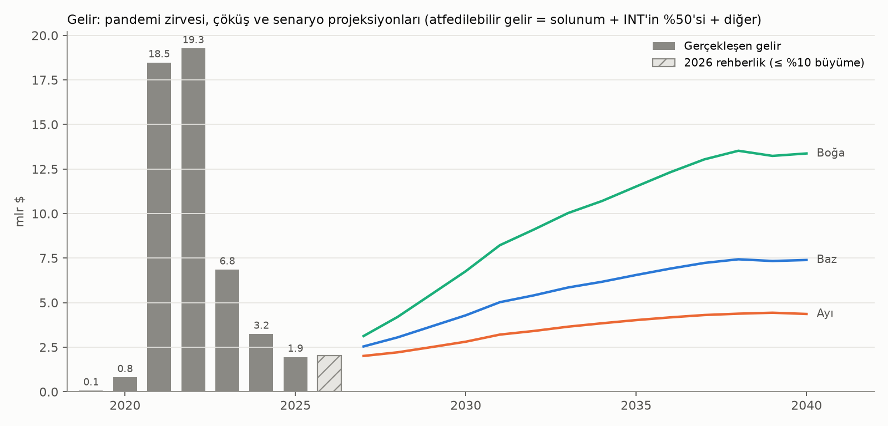
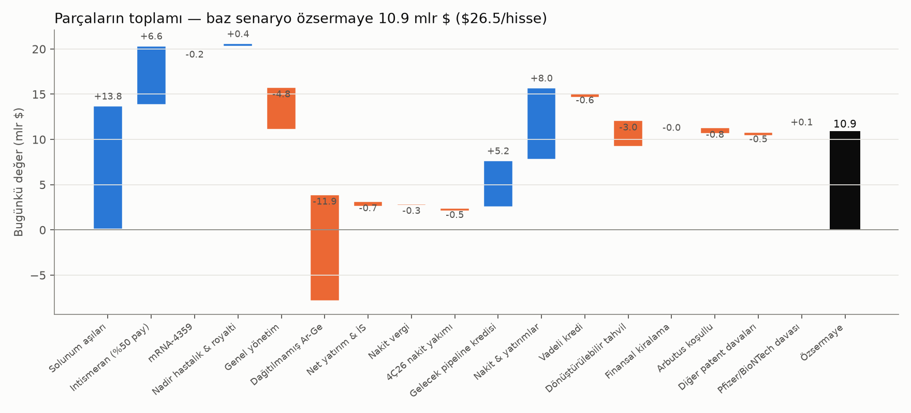
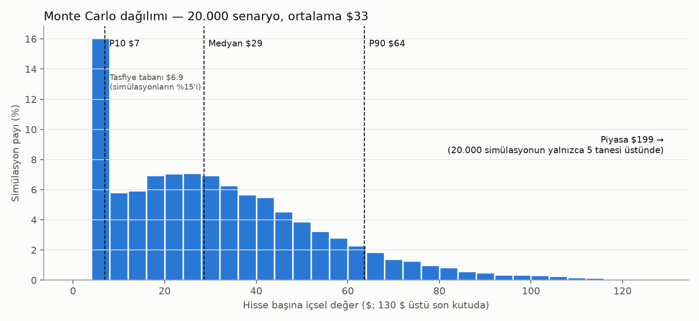
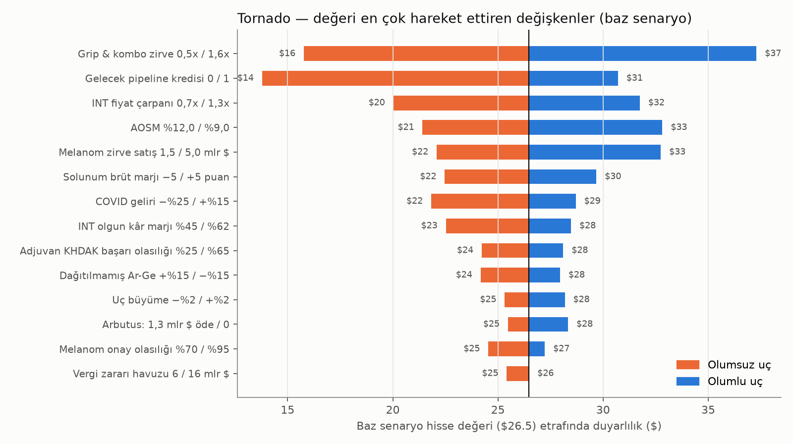

# Moderna, Inc. (NASDAQ: MRNA) — Olasılık Ağırlıklı İçsel Değer Analizi

**Değerleme tarihi:** 30 Eylül 2026 · **Fiyat verisi:** 25 Eylül 2026 kapanışı 198,88 $; 28 Eylül gün içi ~199 $ · **Piyasa değeri:** ~79,6 milyar $ (399,3 milyon hisse)
**Para birimi:** USD · **Muhasebe:** US GAAP, mali yıl sonu 31 Aralık · **CIK:** 0001682852

> **Bu bir analizdir, yatırım tavsiyesi değildir.** Analizi hazırlayan lisanslı bir yatırım danışmanı değildir. Aşağıdaki değer aralıkları, dayandıkları varsayımlar ve bu varsayımları yanlışlayacak gelişmeler sunulmuştur; risk toleransı, pozisyon büyüklüğü ve karar size aittir.

---

## 1. Yönetici özeti

| Ölçüt | Hisse başına değer |
|---|---|
| **Harmanlanmış içsel değer (güvenilirlik ağırlıklı)** | **33 $** |
| Olasılık ağırlıklı senaryo rNPV/DCF | 29 $ |
| Monte Carlo (20.000 simülasyon) — P10 / medyan / P90 | 7 $ / 29 $ / 64 $ |
| Monte Carlo — P95 / P99 | 77 $ / 109 $ |
| Boğa senaryosu | 72 $ |
| "Her şey tutar" tavan testi (ağırlıksız) | 273 $ |
| **Piyasa fiyatı** | **199 $** |
| Harmanlanmış değere göre fark | **−%83** |
| Monte Carlo'da içsel değerin fiyatı aştığı simülasyon | 20.000'de 5 (%0,03) |



**Ana bulgu.** 19 Ağustos 2026'da Merck ile ortak geliştirilen kişiye özel kanser tedavisi **intismeran otojen (mRNA-4157/V940)** melanomda Faz 3'te (INTerpath-001) birincil sonlanım noktasını tutturdu ve hisse tek günde %177 yükseldi (63 $ → 174 $); o zamandan beri 199 $'a çıktı. Bu gerçek ve önemli bir bilimsel başarı; modelimizde melanomun onay olasılığı %88, "gelecek tümörler" dahil 10 endikasyon için risk-ayarlı zirve intismeran satışı **7,3 milyar $** (ayarsız 22 milyar $). Ama Moderna bu satışların **kârının yalnızca %50'sini** alıyor ve bugün yılda ~3 milyar $ nakit yakan bir maliyet tabanını taşıyor.

**Ters DCF ne diyor?** 199 $'ı haklı çıkarmak için:
- Diğer tüm varsayımlar baz senaryoda kalırsa, intismeran zirve satışlarının baz senaryonun **~11 katı** olması gerekir (risk-ayarlı, fiyat çarpanı öncesi 7,3 → ~81 milyar $).
- **On endikasyonun hepsi %100 başarılı** olsa ve boğa ticari koşulları (ABD'de ~420 bin $ net fiyat, %62 marj, güçlü solunum franchise'ı) gerçekleşse bile, gereken zirve **yıllık intismeran satışı ~69 milyar $**'dır (AOSM %9 ile ~52 milyar $). Yayımlanmış en iyimser analist tahminleri 9–17 milyar $ aralığında (Wolfe 9,2; Goldman melanom+akciğer 10,9; Morningstar 2035'te 16,8 milyar $).
- Sinerji yaratabilen bir alıcı (Merck tipi; kurumsal maliyetleri keser, %7,5 sermaye maliyeti) için bile, her endikasyon başarılıyken gereken zirve satış **~34 milyar $** — yayımlanmış en iyimser tahminin ~2 katı.

*Düzeltme notu (29.09.2026): ilk sürümde bu satırlar fiyat çarpanı öncesi model girdisini (~51 milyar $) raporluyordu; gerçek satış dolarıyla karşılığı ~69 milyar $'dır. Düzeltme farkı büyütür, sonucu değiştirmez.*
- Baz nakit akışlarında ima edilen iskonto oranı **%2** (bizim AOSM: %10,4).
- Fiyat, boğa (72 $) ile tavan testi (273 $) arasında ~%63 tavan olasılığı ima ediyor.

**Sonuç:** Kanıtların ağırlığı, piyasa fiyatının yayımlanmış en iyimser senaryoların bile çok ötesinde bir sonucu — intismeranın pek çok solid tümörde adjuvan standart tedavi hâline gelmesini — neredeyse kesinmiş gibi fiyatladığını gösteriyor. Dürüst aralık geniş (P10–P90: 7–64 $) çünkü belirsizlik gerçek; ancak bu genişlikte bile fiyat dağılımın çok dışında.

**Birkaç hafta içinde çözülecek en büyük belirsizlik:** Faz 3 risk oranı (HR) henüz açıklanmadı; **ESMO 2026 (23–27 Ekim, Madrid)** kongresinde sunulacak. Tornado analizi ve Monte Carlo sıra korelasyonları değerin en çok melanom zirve satışına, akciğer kanseri (KHDAK) Faz 3 sonuçlarına, intismeran fiyatına ve grip/kombo aşı başarısına duyarlı olduğunu gösteriyor (§10).

---

## 2. Kapsam, kimlik ve sermaye yapısı

- **Şirket:** Moderna, Inc. (Delaware), Cambridge MA. Tek raporlanabilir segment. SIC 2836.
- **Onaylı ürünler (ABD):** Spikevax, mNEXSPIKE (COVID), mRESVIA (RSV), **mFLUSIVA (grip; 5 Ağustos 2026)**. AB'de ayrıca **mCOMBRIAX** (grip+COVID; Nisan 2026).
- **İş tipi:** Kârlılık öncesi / pipeline ağırlıklı biyoteknoloji → **senaryo ağırlıklı rNPV (risk-ayarlı NPV) + açık başarısızlık senaryosu + ters DCF** öncelikli; bankacılık/REIT yöntemleri uygun değil.

**Sermaye yapısı (değerleme tarihi, tahmini):**

| Kalem | milyar $ | Kaynak |
|---|---|---|
| Nakit ve yatırımlar (30.06.2026) | 6,910 | 10-Q 2Ç26 |
| − Arbutus/Genevant uzlaşma ödemesi (Temmuz 2026) | −0,950 | 8-K 05.03.2026; 10-Q |
| + Dönüştürülebilir tahvil net geliri − capped call | +2,628 | 8-K 01.09.2026 (2,9573 − 0,3288) |
| − 3Ç26 tahmini operasyonel nakit yakımı | −0,55 | YS26 nakit rehberliğinden (4,7–5,2) türetildi — **tahmin** |
| **= Tahmini nakit ve yatırımlar (30.09.2026)** | **≈ 8,04** | 3Ç26 10-Q henüz yayımlanmadı |
| Ares vadeli kredi (SOFR+%5,50, ~%9,2; vade 11/2030) | 0,600 | 10-Q not 11 |
| **%0 dönüştürülebilir tahvil (vade 03/2032)** — dönüşüm 210,58 $, capped call tavanı 392,62 $ | 3,000 | 8-K 01.09.2026 |
| Kullanılmamış kredi limiti (DDTL-1 0,4 + DDTL-2 0,5, koşullu) | 0,900 | 10-Q |
| Arbutus koşullu ödeme (Fed. Circuit §1498 temyizine bağlı) | ≤ 1,300 | 8-K 05.03.2026 |

**Hisse sayısı:** 399,3 milyon temel hisse; ~29 milyon opsiyon (ağırlıklı ort. kullanım ~40 $; 10-K 2025: 27,18 M @ 38,63 $), ~13 milyon RSU/PSU (10-Q 2Ç26: toplam 42 M seyreltici araç). Hazine hissesi yöntemi uygulanır; tahvil yalnızca 392,62 $ üstünde net seyreltir (capped call). Hisse başına değerler bu seyreltilmiş sayıya göredir.

---

## 3. Toplanan belgeler (Faz 1)

| Kaynak | Adet | Not |
|---|---|---|
| SEC EDGAR dosyaları (10-K ×8, 10-Q ×23, 8-K ×112 + 8-K/A ×4, DEF 14A ×9, S-1/424B4, S-3ASR, SC TO-I, CORRESP vb.) | 214 dosya / 663 belge | 2018 halka arzından Eylül 2026'ya kadar, tüm ekleriyle; metne çevrildi (586 dosya) |
| Form 4 içeriden işlemler (2024–2026) | 186 dosya / 454 işlem | `data/insider_transactions.csv` |
| SEC XBRL companyfacts (Moderna + 18 emsal) | 19 | Finansal tablolar ve çarpanlar |
| **FDA/CBER BLA belgeleri** (onay mektupları, Düzenleyici Eylem Özeti/SBRA, klinik inceleme notları, prospektüsler) | 38 PDF (37/38 başarılı) | Spikevax BLA 125752, mNEXSPIKE BLA 125835, mRESVIA BLA 125796, mFLUSIVA BLA 125869 |
| ClinicalTrials.gov (API v2) | 143 çalışma | Moderna ve Merck sponsorlu INTerpath dahil |
| Basın bültenleri / sunumlar | Merck–Moderna INTerpath-001 bülteni, Merck INTerpath program belgesi | `presentations/` |
| Piyasa verisi | Nasdaq günlük fiyat (2018–2026), SPY, ABD Hazine getiri eğrisi, ECB döviz | |

**Elde edilemeyenler (aralığı genişletir):** kazanç çağrısı transkriptleri ve yatırımcı günü slaytları (8-K basın bültenleri kullanıldı); INTerpath-001 risk oranı (ESMO'da açıklanacak); 3Ç26 10-Q; ücretli analist konsensüs tahminleri ve emsallerin ileri tahminleri; EMA değerlendirme raporları (EPAR); bir FDA belgesi (CDN engeli); işlem emsallerinin zirve satış paydaları.

---

## 4. Finansal geçmiş ve normalizasyon (Faz 2)

| milyon $ | 2021 | 2022 | 2023 | 2024 | 2025 | TTM 2Ç26 |
|---|---|---|---|---|---|---|
| Gelir | 18.471 | 19.263 | 6.848 | 3.236 | 1.944 | 2.228 |
| Brüt marj (raporlanan) | %86 | %72 | %31 | %55 | %55 | %23 |
| Brüt marj (değer düşüklüğü/uzlaşma hariç) | %86 | %82 | %66 | %72 | %72 | %76 |
| Stok değer düşüklüğü + alım taahhüdü zararı | 0 | 1.917 | 2.341 | 555 | 315 | 297 |
| Ar-Ge | 1.991 | 3.295 | 4.845 | 4.543 | 3.132 | 2.876 |
| SG&A | 567 | 1.132 | 1.549 | 1.174 | 1.018 | 965 |
| FVÖK (raporlanan) | 13.296 | 9.420 | −4.239 | −3.945 | −3.074 | −3.320 |
| FVÖK (normalize; Arbutus 882 M hariç) | 13.296 | 9.420 | −4.239 | −3.945 | −3.074 | −2.438 |
| Hisse bazlı ödeme | 142 | 226 | 305 | 429 | 483 | 462 |
| Faaliyet nakit akışı | 13.620 | 4.981 | −3.118 | −3.004 | −1.873 | −1.073 |
| Serbest nakit akışı | 13.336 | 4.581 | −3.825 | −4.055 | −2.065 | −1.244 |
| Net nakit (borç + finansal kiralama düşülmüş) | 16.806 | 17.147 | 12.706 | 9.457 | 7.500 | 6.282 |



**Normalizasyon kararları:**
- **Hisse bazlı ödeme gerçek maliyettir**, gider olarak bırakıldı; seyrelme hisse sayısında ayrıca işlendi.
- **Stok değer düşüklükleri 2022–2025 her yıl tekrarlandı** → "tek seferlik" değil, talebi öngörülemeyen aşı işinin faaliyet maliyeti. Geri eklenmedi; projeksiyonda brüt marj yolu içinde azalıyor.
- **Arbutus/Genevant uzlaşması** (1Ç26'da SMM'ye 876 M $ + amortisman) FVÖK normalizasyonunda tek seferlik; nakdi Temmuz'da ödendi ve bilançodan düşüldü. Kalan 1,3 milyar $ koşullu ödeme borç benzeri kalem olarak ayrıca modellendi.
- **Faiz geliri faaliyet dışı** (nakdi zaten ekliyoruz).
- **Net kâr → nakit köprüsü:** 2025'te net zarar (−2,82 milyar $) nakit zarardan (−2,07) daha kötü; fark hisse bazlı ödeme (0,48), amortisman (0,21) ve nakit dışı değer düşüklükleri (0,32). TTM'de işletme sermayesi +1,09 milyar $ katkı yaptı — büyük kısmı 950 M $ uzlaşma tahakkukunun henüz ödenmemiş olmasından (Temmuz'da ödendi), yani geçici.

---

## 5. İş ve kalite teşhisleri (Faz 3)

**Birim ekonomisi.** Para bugün yalnızca solunum yolu aşılarında kazanılıyor ve orada da maliyet tabanını karşılamıyor: 2025'te 1,94 milyar $ gelire karşı 5,0 milyar $ faaliyet gideri. Yönetimin 2027 GAAP faaliyet gideri hedefi 4,2–4,6 milyar $; nakit başabaş hedefi 2028.

**Getiriler.** ROIC 2021–22'de anlamsız derecede yüksek (pandemi), 2023'ten beri derin negatif (−%140 ile −%200). Şirket bugün **sermaye maliyetinin altında getiri** sağlıyor; bu, büyümenin değer yaratması için yeni ürünlerin (intismeran, grip/kombo, norovirüs) başarısına bağlı olduğu anlamına geliyor.

**Hendek (moat) ve fade.**
- *Solunum:* Zayıf-orta. COVID'de Pfizer/BioNTech ve Novavax; RSV'de GSK/Pfizer baskın (mRESVIA 2025'te yalnızca 8 M $); grip pazarı olgun ve fiyat baskılı. mFLUSIVA'nın standart doza karşı %26,6 göreli etkinliği (FDA SBRA) gerçek bir farklılaşma, ama 65+ için yalnızca hızlandırılmış onay ve yüksek doz/adjuvanlı aşılara karşı tercihli ACIP önerisi yok. ABD aşı politikası (ACIP'in rolünün daraltılması, "paylaşılan klinik karar") ciddi talep riski.
- *Onkoloji:* Güçlü olabilir. Kişiye özel üretim (tümör dizileme → algoritmik tasarım → hasta başına parti) kopyalanması zor; Merck'in ticari gücü ve Keytruda kombinasyonu. Rakip: BioNTech/Genentech (autogene cevumeran). Patentler ~2037+; biyolojik veri münhasırlığı 12 yıl; IRA fiyat müzakeresi ~13. yıl.

**Muhasebe kalitesi.**
- Tahakkuk oranı 2023–25 negatif (−%3 ile −%7): nakit sonuçlar, raporlanan kârdan daha iyi → **muhafazakâr**.
- Beneish M-skoru 2025: **−3,49** (manipülasyon eşiği −1,78; bayrak yok). Bileşenler %40 gelir düşüşünden bozuluyor, bu yüzden bileşenleri okumak daha doğru; anomali yok.
- Altman Z (piyasa değeri terimi hariç) 0,60 → tek başına sıkıntı bölgesi; ancak 80 milyar $ piyasa değeri ve 8 milyar $ nakit bunu anlamsız kılıyor. Asıl kısıt nakit yakımı (bkz. §12 denetim notu).
- Denetçi EY (2014'ten beri), yeniden düzenleme yok.

**Yönetişim ve teşvikler.**
- 2025 yıllık primi hedefin **%170'i** ödendi — gelir hedefin altında kalmasına rağmen, maliyet kesintisi ve pipeline kilometre taşları sayesinde (DEF 14A 2026). PSU'lar 2022/2023 dilimlerinde %55/%50 hak edildi. Ücret yapısı, maliyet disiplinini ödüllendiriyor ama geliri zayıf ağırlıklandırıyor.
- Sahiplik: Fidelity ~%10, Vanguard ~%9,5, BlackRock ~%6, Baillie Gifford ~%5; CEO Bancel opsiyonlar dahil ~%7,5; Başkan Afeyan (Flagship).
- **İçeriden işlemler:** Mart 2025'te açık piyasa alımları (Bancel ~5 M $ @ ~31 $, Sagan ~1 M $ @ ~32 $). 2026'da ~64 M $ satış — çoğunlukla vadesi dolan opsiyonlarla ilgili 10b5-1 planları (Bancel 2016 opsiyonları, Hoge). Mevcut fiyatlardan açık piyasa alımı yok.

**Başlıca riskler:** (1) ABD aşı politikası ve CBER'in öngörülemezliği (Şubat 2026'da grip başvurusuna gerekçesiz görülen "dosyalama reddi", sonra onay); (2) patent davaları — GSK (ABD duruşmaları Temmuz/Ağustos 2027; UPC Eylül 2026), Northwestern, BioNTech (mNEXSPIKE), CureVac, Sanofi/Translate Bio, Bayer, mNG Bio; hiçbiri için karşılık ayrılmadı; (3) Arbutus 1,3 milyar $ koşullu ödemesi; (4) intismeran üretim ölçeklenmesi ve hasta başı >100 bin $ maliyet; (5) Pfizer/BioNTech'e karşı dava kozunun erimesi (EP'949 patenti Eylül 2026'da EPO Temyiz Kurulu'nca iptal edildi); (6) menkul kıymet toplu davası (RSV beyanları).

---

## 6. Ürünler, pipeline ve FDA başvuruları

**ABD onaylı ürünler (FDA/CBER belgeleri `fda/` klasöründe):**

| Ürün | BLA | İlk onay | Son eylem | Endikasyon / not |
|---|---|---|---|---|
| Spikevax (mRNA-1273) | 125752 | 31.01.2022 | 27.08.2026 (2026–27 formülü) | 65+ ve 6 ay–64 yaş risk grubu |
| mNEXSPIKE (mRNA-1283) | 125835 | 30.05.2025 | 27.08.2026 | 65+ ve 12–64 risk grubu; doz Spikevax'ın 1/5'i |
| mRESVIA (mRNA-1345) | 125796 | 31.05.2024 | 07.08.2026 | 60+ ve 18–59 risk grubu (12.06.2025) |
| **mFLUSIVA (mRNA-1010)** | **125869** | **05.08.2026** | — | 50–64 tam onay, 65+ hızlandırılmış; P304'te 40.805 kişide göreli etkinlik %26,6 (%95 GA 16,7–35,4). Onay sonrası zorunlu 65+ doğrulayıcı çalışma (P910); SBRA'da "nedeni belirtilmemiş ölümlerde sayısal dengesizlik" notu ve ek güvenlik takibi taahhütleri |

**Pipeline ve başarı olasılıkları (baz senaryo, modelde kullanılan):**

| Program | Ortaklık | Faz / durum | Baz lansman | Ayarsız zirve (mlr $) | PoS | Kaynak |
|---|---|---|---|---|---|---|
| Intismeran — adjuvan melanom IIB–IV (INTerpath-001, n=1.137) | Merck %50/50 | Faz 3 pozitif (ara analiz, 19.08.2026); FDA Çığır Açan Tedavi, EMA PRIME | 2027 | 2,8 | %88 | Merck/Moderna bülteni; NCT05933577 |
| Intismeran — adjuvan KHDAK II–IIIB (INTerpath-002, n=868) | Merck | Faz 3, birincil tamamlanma Haz 2030 | 2031 | 4,0 | %45 | NCT06077760 |
| Intismeran — neoadjuvan sonrası pCR olmayan KHDAK (009) | Merck | Faz 3, 2033 | 2034 | 1,5 | %40 | NCT06623422 |
| Intismeran — rezeke evre I KHDAK (014) | Merck | Faz 3, 2034 | 2035 | 2,5 | %35 | NCT07513376 |
| Intismeran — adjuvan böbrek (RCC, 004) | Merck | Faz 2, Nis 2027 | 2031 | 1,2 | %25 | NCT06307431 |
| Intismeran — kas invaziv mesane (005) | Merck | Faz 1/2, 2029 | 2033 | 1,0 | %20 | NCT06305767 |
| Intismeran — NMIBC + BCG (011) | Merck | Faz 2, 2031 | 2034 | 1,0 | %15 | NCT06833073 |
| Intismeran — 1. basamak ileri melanom (012) | Merck | Faz 2, 2028 | 2031 | 0,8 | %20 | NCT06961006 |
| Intismeran — 1. basamak metastatik skuamöz KHDAK (013) | Merck | Faz 2, 2029 | 2032 | 1,2 | %15 | NCT07221474 |
| Intismeran — diğer solid tümörler (gelecek) | Merck | Faz 1 / başlamadı | 2035 | 6,0 | %10 | NCT03313778; platform okuması |
| mRNA-4359 (PD-L1/IDO kanser antijeni) | %100 | Faz 1/2 | 2031 | 2,0 | %10 | 10-K 2025 |
| mCOMBRIAX (grip+COVID) | %100 | AB onaylı; ABD yeniden başvuru bekliyor | 2027 | 1,4 | ABD %70 | 10-Q 2Ç26 |
| Norovirüs (mRNA-1403, ~38 bin kişi) | %100 | Faz 3 ara analizde erken başarı kriterini tutturamadı (Tem 2026) | 2029 | 1,2 | %30 | 8-K 31.07.2026 |
| Propiyonik asidemi (mRNA-3927) | Recordati (royalti) | Kayıt çalışması, veri 2026 | 2028 | 0,4 (royalti %15) | %55 | 10-Q 2Ç26 |
| Metilmalonik asidemi (mRNA-3705) | %100 | Pivotal karar ertelendi | 2031 | 0,4 | %20 | 8-K 31.07.2026 |
| Kistik fibroz (VX-522) | Vertex (royalti) | Faz 1/2 | 2031 | 0,8 (royalti %10) | %10 | 10-K 2025 |

İntismeran fiyat varsayımı: ABD net ~300 bin $/kür, ABD dışı ~135 bin $ (William Blair modeli 475 bin $ liste fiyatı varsayıyor; üretim maliyeti bugün hasta başı >100 bin $). Kâr havuzu marjı lansmanda %20, 5 yılda %55'e çıkıyor; Moderna'nın payı %50. Moderna'nın geliştirme maliyeti payı ~0,4 milyar $/yıl (10-Q: çeyrekte net 97 M $).

---

## 7. Yönetim rehberliği ve güvenilirliği (Faz 4)

Rehberliğin ne kadarının gerçekleştiği, 2022–2026 arası tüm 8-K basın bültenlerinden yeniden kuruldu (`data/guidance_log.csv`). **Geri çekilen/sessizce emekliye ayrılan hedefler ıskalama sayıldı.**

| Yıl | İlk gelir rehberliği (tarih) | Gerçekleşen | Seviye isabeti |
|---|---|---|---|
| 2022 | ~18,5 mlr $ ürün satışı (Oca 2022); Mayıs'ta 21'e yükseltildi | 18,4 | %99 (Mayıs rehberliğine göre %88) |
| 2023 | "en az ~5 mlr $" (Oca 2023) | 6,67 | %133 (taban) |
| 2024 | ~4 mlr $ (Kas 2023) | 3,11 | **%78** |
| 2025 | 2,5–3,5 mlr $ (Eyl 2024) | 1,94 | **%65** |
| 2026–28 | "%25+ YBBO" (Eyl 2024) | — | **Emekliye ayrıldı** → "2026'da %10'a kadar büyüme" |
| Başabaş | "2026'da başabaş" (Oca 2024) | — | **2028'e ertelendi** |

| Kategori | İsabet oranı | Güven 1 yıl | 2 yıl | 3 yıl |
|---|---|---|---|---|
| Gelir | %60 | **65** | 55 | 47 |
| Maliyet (Ar-Ge, faaliyet gideri) | %100 (hep daha düşük gerçekleşti) | **92** | 78 | 67 |
| Yıl sonu nakit | %100 (hep daha yüksek) | **91** | 77 | 66 |
| Pipeline zamanlaması | %50 (grip 2023→2026, CMV başarısız, norovirüs ara analiz ıskaladı; mNEXSPIKE, RSV 18–59, melanom zamanında) | **56** | 48 | 40 |
| Kârlılık zamanlaması | %0 | **14** | 12 | 10 |

**Modele aktarım (aritmetik):** Maliyet rehberliğine güven yüksek → 2026–27 Ar-Ge/SG&A yolu yönetim rakamlarına bağlandı (2027 toplam gider ~4,2 milyar $, kılavuzun alt ucu). Gelir güveni düşük ve ufukla hızla azalıyor → yönetimin "2028'de ~4–6 milyar $ gelirle başabaş" patikası **boğa** senaryosuna taşındı; baz senaryo aşağıdan yukarı kuruldu (2028 atfedilebilir gelir 3,05 milyar $; ilk pozitif FVÖK 2031). 2026 geliri için: 1 yıllık gelir güveni 65 ≥ 60 eşiği → baz = rehberlik orta noktası (1,944–2,14 → 2,04 milyar $); rehberliğin üst ucu (2,14) boğa, 2025 seviyesinin %94'ü (ilk rehberliklerin ortalama isabeti) ayı.

---

## 8. Emsaller (Faz 5)

13 ticari ölçekli emsal (gelir ≥ 1 milyar $): Alnylam 8,6x, argenx 13,8x, Vertex 10,0x, Exelixis 5,6x, Incyte 4,2x, BioMarin 4,6x, Regeneron 4,3x, BioNTech 2,5x, AstraZeneca 4,8x, Merck 6,2x, Pfizer 3,5x, GSK 2,7x, Sanofi 2,3x (FD/son 12 ay satış). Kesit regresyonu: ln(FD/Satış) = 1,39 + 1,17 × 3 yıllık büyüme + 0,23 × faaliyet marjı (R² 0,62). Moderna'nın bugünkü FD/Satış'ı (~34x son 12 ay gelirine göre) emsal aralığının çok dışında; bu yüzden çarpan yöntemi 2030 tahmini gelirine uygulandı (§9.5). Novavax (3,3x) ve BioNTech (2,5x) — en yakın mRNA/aşı emsalleri — ilginç biçimde en düşük çarpanlarda.

---

## 9. Değerleme — her açıdan (Faz 6)

**İskonto oranı (AOSM %10,43):** risksiz faiz %5,17 (10 yıllık ABD Hazine, 25.09.2026) + beta 1,20 (haftalık, SPY'a karşı; 19 Ağustos sıçraması hariç 3 yıllık 1,32, 5 yıllık 1,17; Blume düzeltmeli 1,11–1,22) × hisse risk primi %4,5 = özsermaye maliyeti %10,57; borç ağırlığı %4,5 × %7,5 (NOL'lar nedeniyle vergi kalkanı yok). Duyarlılık: %9 → 33 $, %12 → 21 $ (baz).

**Vergi:** %19 nakit vergi; ~12,5 milyar $ NOL/kesinti havuzu (federal NOL 4,1 milyar $ + 2026 zararı + 2025 vergi yasası sonrası aktifleştirilmiş Ar-Ge kesintileri; **tahmin**), gelirin %80'i ile sınırlı kullanım.

### 9.1 Senaryo rNPV / FCFF DCF

| Senaryo | Olasılık | Tanım | Hisse değeri |
|---|---|---|---|
| Başarısızlık | %10 | ESMO verisi zayıf (HR ~0,85) / FDA genel sağkalım ister → melanom onaylanmaz; diğer INT PoS %60 düşer; solunum ayı | **6,9 $** (tasfiye tabanı; tabansız −12,4 $) |
| Ayı | %25 | Melanom 2028'de mütevazı HR (~0,75) ile onay, zirve 1,5 mlr $, ABD ~225 bin $; KHDAK PoS kesintisi; COVID daha hızlı erir; grip/kombo baz'ın %60'ı | **6,9 $** (tabansız −2,8 $) |
| Baz | %45 | §6'daki varsayımlar; solunum aşağıdan yukarı | **26,5 $** |
| Boğa | %20 | Güçlü HR (~0,55) ve sağkalım eğilimi; ABD ~420 bin $; melanom zirve 5 mlr $; diğer INT PoS ×1,33; solunum 5–6 mlr $ (yönetim patikası) | **72,2 $** |
| *Tavan testi (ağırlıksız)* | — | Tüm INT endikasyonları %100 başarılı, zirveler ×1,5, 475 bin $ fiyat, %62 marj, AOSM %8, g %2 | *272,7 $* |
| **Olasılık ağırlıklı** | | | **28,8 $** |

Olasılıkların dayanağı: pozitif Faz 3 onkoloji BLA'larının onay oranı ~%85–90; önceden belirlenmiş ara analizde başarı HR'nin muhtemelen <0,75 olduğunu ima ediyor ama büyüklüğü bilinmiyor; lansmanların yaklaşık üçte ikisi satış tarafı zirve tahminlerinin altında kalır; Moderna'nın kendi lansman karnesi karışık (Spikevax ≫, mRESVIA ≪, mNEXSPIKE ≈); gelir rehberliği güveni 3 yılda 47. → aşağı yönlü çarpık ağırlıklar (**yargı**).

**Tasfiye tabanı:** Sınırlı sorumluluk + terk opsiyonu: sürdürmenin değer yok ettiği yollarda yönetim nakit yakmaya devam etmez, yeniden yapılanır veya solunum franchise'ını satar. Başarısızlık ve ayı senaryoları ile simülasyonların %15'i bu tabana (6,9 $) düşüyor.

### 9.2 Parçaların toplamı (baz)



| Bileşen (BD, milyar $) | Baz | Boğa |
|---|---|---|
| Solunum aşı franchise'ı | 13,8 | 22,1 |
| Intismeran (%50 kâr payı, geliştirme dahil) | 6,6 | 20,6 |
| mRNA-4359 | −0,2 | −0,2 |
| Nadir hastalık ve royaltiler | 0,4 | 0,5 |
| Kurumsal genel yönetim | −4,8 | −4,9 |
| Dağıtılmamış Ar-Ge (platform/ortak/hisse bazlı ödeme) | −11,9 | −12,7 |
| Net yatırım ve işletme sermayesi | −0,7 | −1,3 |
| Nakit vergiler (NOL sonrası) | −0,3 | −3,8 |
| 4Ç26 nakit yakımı | −0,5 | −0,5 |
| Gelecek pipeline kredisi (Ar-Ge'nin yaratacağı değer) | 5,2 | 7,5 |
| **Firma değeri** | **7,7** | **27,3** |
| + Nakit (tahmini) / − vadeli kredi / − tahvil / − kiralama | +8,04 / −0,6 / −3,0 / −0,04 | aynı |
| − Arbutus koşullu (beklenen BD) / − diğer davalar / + Pfizer opsiyonu | −0,77 / −0,5 / +0,05 | −0,77 / −0,3 / +0,05 |
| **Özsermaye** | **10,9** | **30,7** |

Terminal değerin FD içindeki payı: baz %19, boğa %19 (denetim eşiği %50'nin altında).

**Önemli modelleme tercihi — dağıtılmamış Ar-Ge:** 2025 Ar-Ge'sinin (3,1 milyar $) yalnızca 0,9 milyar $'ı programa özgü dış harcama. Kalan platform/teknik geliştirme/ortak maliyetler (2027'de ~1,2 milyar $) tam maliyet olarak düşüldü; karşılığında ürettiği gelecek pipeline için "kredi" = 0,75 × (2032'ye kadar platform payı + 2033'ten itibaren tümü) vergi sonrası BD'si. 1,0 = Ar-Ge tam olarak sermaye maliyeti kadar getiri sağlar; 0,75 Moderna'nın son dönem karışık Ar-Ge verimliliğini yansıtır (**yargı**; tornado'da 0/1 aralığı 14–31 $).

### 9.3 Monte Carlo (20.000 simülasyon)



Aynı model üzerinde: 10 intismeran endikasyonu için korelasyonlu başarı (Gauss kopula, ortak "platform" faktörü ρ=0,5), zirve satışlar log-normal (σ=0,5), fiyat (σ=0,25), olgun marj U(%45, %62), melanom lansmanında %40 bir yıl gecikme; COVID/grip/kombo/RSV seviyeleri log-normal; kombo ABD onayı, norovirüs, PA, MMA, CF, mRNA-4359 Bernoulli; brüt marj, Ar-Ge çarpanı, AOSM N(%10,43; 0,8 puan), uç büyüme U(−%1, +%2), Arbutus sonucu (tam %60 / kısmi %10 / sıfır %30), diğer dava maliyeti log-normal.

| P5 | P10 | P25 | Medyan | P75 | P90 | P95 | P99 | Ortalama |
|---|---|---|---|---|---|---|---|---|
| 6,9 $ | 6,9 $ | 14,1 $ | 28,6 $ | 45,3 $ | 63,6 $ | 77,3 $ | 108,5 $ | 33,0 $ |

- Melanom onaylanırsa ortalama 35,1 $; onaylanmazsa 17,9 $.
- Değerle en yüksek sıra korelasyonu: adjuvan KHDAK başarısı (0,43), melanom zirve çarpanı (0,41), evre I KHDAK başarısı (0,32), kombo zirvesi (0,28), melanom onayı (0,28), COVID seviyesi (0,25), norovirüs (0,22), INT fiyatı (0,20).

### 9.4 Ters DCF — piyasa ne biliyor/varsayıyor?

| Soru | Cevap |
|---|---|
| Diğer her şey baz iken gereken risk-ayarlı INT zirve satışı | **~81 milyar $** (baz 7,3; 11,1x) |
| Tüm 10 endikasyon %100 başarılı, baz ticari koşullar → gereken zirve yıllık INT satışı | **~91 milyar $** |
| Tüm endikasyonlar başarılı + boğa fiyat/marj/solunum → gereken zirve yıllık INT satışı | **~69 milyar $** (AOSM %9 ile ~52; en iyimser analist 9–17) |
| Aynısı, sinerjili alıcı gözüyle (%7,5 AOSM, kurumsal maliyetlerin çoğu elenmiş) | **~34 milyar $** |
| Yalnızca melanom zirvesiyle kapatmak için | ~67 milyar $ (anlamsız; ABD'de uygun hasta ~14 bin/yıl) |
| Baz nakit akışlarında ima edilen AOSM | **%2,0** |
| Boğa (72 $) ile tavan (273 $) arasında ima edilen tavan olasılığı | **%63** |

Yorum: Fiyat, iskonto oranıyla değil, nakit akışı beklentileriyle açıklanabiliyorsa bile, gereken beklenti yayımlanmış hiçbir tahminle desteklenmiyor. Her 1 milyar $ risk-ayarlı intismeran zirve satışı Moderna hissesine yalnızca ~2,3 $ ekliyor (%50 pay × ~%55 marj × vergi × zamanlama).

### 9.5 Diğer yöntemler

| Yöntem | Düşük | Orta | Yüksek | Not |
|---|---|---|---|---|
| **İleri emsal çarpanı** (2030T atfedilebilir gelir 4,29 mlr $ × regresyonla 4,9x FD/Satış, 4,25 yıl iskonto + ara nakit yakımı) | 22,0 $ | 30,4 $ | 38,8 $ | ±%25 çarpan |
| **İşlem referansı** (2,5–4,5x risk-ayarlı zirve atfedilebilir gelir 7,4 mlr $) | 52,0 $ | 68,8 $ | 85,7 $ | Kontrol değeri; alıcı sinerjilerini (Moderna'nın kurumsal maliyetlerinin elenmesi) içerir; 80 milyar $'lık alıcı evreni çok dar; paydalar geri çekilmedi → **yargı aralığı** |
| **Kazanç gücü değeri** (büyümesiz: bugünkü 2,04 mlr $ gelir, %72 brüt marj, bakım Ar-Ge'si) | 11,4 $ | 11,4 $ | 11,4 $ | Bugün var olan iş; fiyatın ~%94'ü büyüme bahsi |
| **Varlık / tasfiye tabanı** (nakit + MDV'nin %30'u − tasfiye maliyeti − borçlar − Arbutus) | 6,9 $ | 6,9 $ | 6,9 $ | |

**Dahil edilmeyen yöntemler:** FCFE (sermaye yapısı bilinçli olarak yeniden kaldıraçlanmıyor; %0 tahvil ve küçük kredi köprüde açıkça işlendi); artık gelir (defter değeri giderleştirilmiş Ar-Ge ve pandemi kârlarından oluşuyor, anlamlı çapa değil); temettü indirgeme (temettü yok; 1,7 milyar $ geri alım yetkisi kullanılmıyor); cari P/E ve FD/FAVÖK (negatif).

---

## 10. Olasılık ağırlıklı sentez (Faz 7)

| Yöntem | Orta değer | Ağırlık | Gerekçe |
|---|---|---|---|
| Senaryo rNPV/DCF (olasılık ağırlıklı) | 28,8 $ | %45 | Varlık düzeyinde risk açık; birincil yöntem |
| Monte Carlo (ortalama) | 33,0 $ | %25 | Dört nokta yerine dağılım; korelasyonlu sonuçlar |
| İleri emsal çarpanı | 30,4 $ | %15 | Piyasa çapraz kontrolü; baz 2030 gelirine bağlı |
| İşlem referansı | 68,8 $ | %10 | Kontrol değeri; küçük alıcı evreni |
| Kazanç gücü değeri | 11,4 $ | %2,5 | Taban benzeri |
| Varlık tabanı | 6,9 $ | %2,5 | Aşağı yön tabanı |
| **Harmanlanmış içsel değer** | **33,1 $** | %100 | |

**Sahte kesinliğe karşı uyarı:** Yöntemler bağımsız değil — hepsi aynı gelir, marj ve iskonto varsayımlarını paylaşıyor. Onları ortalamak dağılımı yapay biçimde daraltır. Dürüst belirsizlik aralığı Monte Carlo'nunkidir: **P10–P90 = 7–64 $**, P95 = 77 $. Tek nokta tahmini (33 $) kararın kendisi değil, dağılımın merkezidir.

**En önemli duyarlılıklar (baz etrafında):**



1. Grip & kombo zirve satışları (16–37 $)
2. Gelecek pipeline kredisi / Ar-Ge verimliliği (14–31 $)
3. Intismeran fiyatı (20–32 $)
4. AOSM (21–33 $) ve melanom zirvesi (22–33 $)

Hiçbir tek değişken değeri 40 $'ın üzerine taşımıyor; 199 $'a ulaşmak birçok değişkenin **aynı anda** uç değerlerde gerçekleşmesini gerektiriyor (tavan testi).

**Tahmini maddi olarak değiştirecek gözlemlenebilir olaylar:**

| Tarih | Olay | Yön |
|---|---|---|
| **23–27 Ekim 2026** | **ESMO: INTerpath-001 HR, DMFS, erken sağkalım** | HR ≤0,55 → boğaya doğru (+); HR ≥0,75 → ayıya doğru (−) |
| Kasım 2026 başı | 3Ç26 sonuçları (nakit, grip lansmanı, sezon satışları) | Nakit tahmini doğrulaması |
| 12 Kasım 2026 | Analist Günü (2027–28 finansal çerçeve, INT başvuru planı, fiyatlandırma ipuçları) | Rehberlik güveni düşük; maliyet kısmı güvenilir |
| 2026 sonu | Propiyonik asidemi kayıt verisi | Küçük (+/−) |
| 2026–27 | Federal Circuit §1498 kararı (Arbutus 0–1,3 mlr $) | ±3 $ |
| 2027 | INT BLA kabulü / öncelikli inceleme; ABD fiyatı | Büyük |
| Nisan 2027 | RCC Faz 2 (INTerpath-004) verisi | Platform okuması |
| Tem–Ağu 2027 | GSK ABD patent duruşmaları | Aşağı yön riski |
| 2030 | Adjuvan KHDAK Faz 3 (INTerpath-002) | **Tek en büyük pipeline değeri** |

---

## 11. Karşı tez — güçlü boğa argümanı

Bu değerlemenin yanlış olabileceği en güçlü senaryo:

1. **Platform etkisi, endikasyon toplamından büyüktür.** Keytruda'nın zirve satışları lansmanda ~1–3 milyar $ tahmin edilirken 30 milyar $'ı aştı; ilk-sınıf bir onkoloji platformunu satış tarafı sistematik olarak küçümser. Intismeran, adjuvan ortamda Keytruda'ya ilave fayda gösteren **ilk** tedavi; mekanizma tümörden bağımsız (neoantijen tanıma) ve 5 yıllık Faz 2b verisi (HR 0,51) kalıcı.
2. **Fiyatlandırma gücü.** Kişiye özel, üretimi zor; 475 bin $ liste fiyatı (William Blair varsayımı) ve Merck'in erişim gücü.
3. **Maliyet tabanı esnek.** Yönetim maliyet rehberliğini hep aşarak tutturdu (güven 92/100); Ar-Ge 4,8 → 2,9 milyar $'a indi, daha da inebilir.
4. **Stratejik seçenek.** Merck'in Moderna'yı satın alarak intismeranın %100'üne sahip olması, kontrol primiyle çok daha yüksek bir değer ima edebilir.

**Neden hâlâ ikna edici değil (sayılarla):** Bu dört maddenin **hepsini** tavan testinde birlikte varsaydık (tüm endikasyonlar başarılı, 475 bin $, %62 marj, %8 AOSM, güçlü solunum, Ar-Ge'nin tam değer yaratması) — sonuç 273 $. 199 $, bu uç dünyaya ~%63 olasılık vermek demek. İşlem referansı (sinerjiler dahil) bile 52–86 $; sinerjili alıcı modeli baz 59 $, boğa 126 $. Ayrıca platform argümanının bir kısmı (gelecek tümörler, %10 PoS × 6 milyar $) ve Ar-Ge'nin yaratacağı gelecek değer (5,2 milyar $) baz senaryoda zaten var.

**Bu analizi yanlışlayacak kanıtlar:** (a) ESMO'da HR ≤0,5 ve genel sağkalımda erken ayrışma; (b) Merck/Moderna'nın ABD fiyatını ≥400 bin $ açıklaması ve geri ödeme kapsamı; (c) KHDAK Faz 3'lerden birinin ara analizde erken başarısı; (d) solunum gelirinin yönetimin 2028 başabaş patikasına (4–6 milyar $) oturması; (e) bir satın alma teklifi. Bunlardan ikisi veya üçü gerçekleşirse değer aralığımız boğa senaryosuna (70–110 $) kayar — yine de fiyatın altında.

---

## 11b. "Piyasa aptal değil" — kaçırdığım bir şey var mı? (29.09.2026 sorgulaması)

Fiyat ile model arasındaki fark bu büyüklükte olunca önce modelden şüphelenmek gerekir. Aşağıdakileri tek tek aradım ve sayısal olarak test ettim:

| Hipotez | Bulgu | Farkı kapatıyor mu? |
|---|---|---|
| Yeni bir haber/veri var (HR sızdı, anlaşma açıklandı) | Hayır. HR hâlâ açıklanmadı; ESMO'da **Başkanlık Sempozyumu (LBA1, 24 Ekim)** — güçlü veriye işaret eden prestijli bir slot. Analist beklentisi HR ~0,65. BAE görüşmesinde rakam/anlaşma yok. | Kısmen (baz senaryom zaten HR <0,75 varsayıyor) |
| Satış tarafı fiyatın üstünde | Konsensüs hedef ~77 $ (Motley Fool, 28.09); bulunan en yüksek güncel hedef Argus 180 $. "Deutsche Bank 225 $" haberi 2023 tarihli. | Hayır |
| Merck satın alması | Görüş yazısı (Motley Fool) 210–215 $ önerdi; tahmin piyasası (Polymarket, Ağustos) 2026'da anlaşma olmayacağına %98 fiyat verdi. **Sinerjili alıcı modeli: baz 59 $, boğa 126 $, tavan 319 $.** | Kısmen — ancak boğanın da üstünde bir dünya gerekiyor |
| İskonto oranım fazla yüksek | AOSM %9 → baz 33 $; boğa koşulları + %9 → 92 $; + %8 → 107 $ | Hayır |
| Fiyat/marj varsayımım muhafazakâr | 475 bin $ ve %62 marj tavan testinde var (273 $) | Yalnızca her şey birlikte tutarsa |
| Platform (tüm solid tümörler) tezi | Baz senaryoda "gelecek tümörler" = 6 milyar $ × %10. Fiyatı açıklamak için gereken zirve satış ~52–69 milyar $/yıl (sinerjili alıcıda ~34). Karşılaştırma: Keytruda ~30 milyar $/yıl (yaklaşık, hafızadan) | **Evet — tek açıklayıcı bu** |
| Piyasa mRNA onkolojisine genel prim veriyor | BioNTech (bireyselleştirilmiş neoantijen programı dahil) FD ~8 milyar $ (piyasa değeri 25, nakit 17). Moderna FD ~75 milyar $. | Hayır — prim şirkete özel |
| Pozisyon/akım etkileri | Açığa satış 52,8 M → 32,9 M hisse (14.08 → 15.09); Eylül'de alım opsiyonu/satım 3:1; 11–28 Eylül'de yeni veri olmadan +%46 | Fiyatın bir kısmını açıklar (temel değil) |

**Sonuç:** Kaçırdığım somut bir olgu bulamadım. Fiyatı açıklayabilen tek şey bir **inanç farkı**: intismeranın birçok tümör tipinde standart tedavi hâline gelip Keytruda ölçeğine (yılda onlarca milyar $) ulaşacağına dair yüksek bir olasılık. Bu imkânsız değil — tavan testi 273 $ — ama bugün elimizde tek bir tümörde tek bir ara analiz var ve risk oranı bile bilinmiyor.

**Piyasa neden yine de bu fiyatı verebilir?**
1. Fiyat ortalama yatırımcıyı değil **marjinal alıcıyı** yansıtır. Açığa satanlar pozisyon kapatıp çekildikten sonra fiyatı en iyimser katılımcılar belirleyebilir (fikir ayrılığı + açığa satış kısıtı, Miller 1977).
2. Aynı piyasa 19 Ağustos'ta +%177, ertesi gün −%24 (~16 milyar $) fiyatladı; yani "piyasa" tek bir görüş değil.
3. Moderna'nın kendi geçmişi: 9 Ağustos 2021'de 484 $ (piyasa değeri ~190 milyar $), 20 Kasım 2025'te 22 $ (−%95). Piyasa uzun vadede tartar, kısa vadede oy sayar.

**Benim yanıldığım senaryo:** ESMO'da HR ≤0,5 + genel sağkalımda erken ayrışma, akciğer çalışmalarından erken sinyal ve Merck'in agresif genişleme/fiyat planı. Bu durumda değer aralığım boğa–sinerjili alıcı bölgesine (70–130 $) kayar. 199 $ ise bunun da ötesinde, platformun birden çok büyük tümörde tutmasını gerektirir.

## 12. Denetim bulguları (Faz 8)

`scripts/audit_model.py` Excel modelini LibreOffice'te yeniden hesapladı: **5.635 formül, 0 hata; motor ile model arasındaki en büyük sapma 3×10⁻¹⁵**; 40 kontrol, 0 FAIL, 3 WARN.

- **Uyarı (likidite):** Başarısızlık ve ayı senaryolarında yeniden yapılanma olmadan nakit negatife düşerdi; bu senaryolar zaten tasfiye tabanında değerlendi. **Baz senaryoda** 2032'de 3 milyar $ tahvil ve 0,6 milyar $ kredi geri ödendikten sonra nakit ~−0,1 milyar $'a iniyor → ~0,6 milyar $'lık yeniden finansman gerekiyor; modelde seyrelme olarak işlenmedi (baz değere etkisi ~%2). Boğa senaryosunda en düşük nakit 4,6 milyar $.
- Terminal değer payı: baz %19, boğa %19, tavan %41 (hepsi eşik altında). Tüm ağırlıklı senaryolar aynı AOSM'yi kullanıyor; tavan testi bilinçli olarak %8.
- Opsiyonlar tek bir ağırlıklı ortalama kullanım fiyatıyla (40 $) modellendi; gerçekte bir kısmının kullanım fiyatı 19–30 $ → 26 $ civarındaki değerlerde seyrelme hafifçe eksik tahmin ediliyor (etkisi <%1).

---

## 13. Varsayımlar eki (en kritik olanlar)

Tüm girdiler `data/assumptions.json` ve Excel'deki **Drivers** sekmesinde (mavi = girdi; sarı = kilit varsayım). Kaynağı olmayanlar "YARGI" olarak işaretli.

| Varsayım | Baz | Kaynak / gerekçe |
|---|---|---|
| Tahmini nakit 30.09.2026 | 8,04 mlr $ | 10-Q + 8-K'lar; 3Ç yakımı **tahmin** |
| AOSM | %10,43 | Yukarıdaki yapı |
| Melanom zirve / PoS / lansman | 2,8 mlr $ / %88 / 2027 | Epidemiyoloji (ABD ~14 bin/yıl IIB–IV rezeke), fiyat 300 bin $; **yargı** |
| INT kâr havuzu marjı | %20 → %55 | Üretim >100 bin $/hasta bugün; **yargı** |
| COVID gelir yolu 2027–32 | 1,85 → 1,30 mlr $ | 2025: 1,81; ABD politika rüzgârı, 2027 AB ihalesi |
| mFLUSIVA / kombo zirve | 0,8 / 1,4 mlr $ | rVE %26,6; ACIP tercihi yok; kombo ABD PoS %70 |
| Solunum brüt marjı | %64 → %75 | Yönetim: 3 yılda +10 puan |
| 2027 dağıtılmamış Ar-Ge | 1,2 mlr $ | 2027 gider rehberliğiyle uyumlu |
| Gelecek pipeline kredisi | 0,75 | **yargı** |
| NOL havuzu | 12,5 mlr $ | 10-K not 14 + tahmin |
| Arbutus ödeme olasılığı | tam %60 / kısmi %10 | Fed. Circuit onama taban oranı ~%70; **yargı** |
| Diğer patent davaları | 0,5 mlr $ | Arbutus sonucu referans; **yargı** |
| Senaryo olasılıkları | %10 / %25 / %45 / %20 | §9.1; **yargı** |

---

## 14. Dosyalar ve yeniden üretim

```
valuation/MRNA/
  output/MRNA_degerleme_raporu.md   ← bu rapor
  output/*.png                      ← grafikler
  model/MRNA_model.xlsx             ← canlı formüllü model (Drivers'ı değiştirin, her şey yeniden hesaplanır)
  data/assumptions.json             ← tüm girdiler
  data/valuation_results.json       ← motor çıktıları
  scripts/                          ← fetch_edgar, fetch_fda, fetch_insiders, xbrl_financials, diagnostics,
                                      guidance_tracker, comps_analysis, valuation_engine, build_model_xlsx,
                                      audit_model, football_field
```

Yeniden çalıştırma: `python scripts/valuation_engine.py && python scripts/build_model_xlsx.py && python scripts/audit_model.py --workbook model/MRNA_model.xlsx --results data/valuation_results.json --peers data/peers.json && python scripts/football_field.py`. Ham SEC/FDA indirmeleri (~250 MB) depoya konmadı; `fetch_*.py` betikleri yeniden indirir.

## 15. Kaynaklar (erişim: 28 Eylül 2026)

- SEC EDGAR — Moderna dosyaları (CIK 1682852): 10-K 2025 ([link](https://www.sec.gov/Archives/edgar/data/1682852/000168285226000033/mrna-20251231.htm)), 10-Q 2Ç26 ([link](https://www.sec.gov/Archives/edgar/data/1682852/000168285226000150/mrna-20260630.htm)), 8-K 2Ç26 sonuçları ([link](https://www.sec.gov/Archives/edgar/data/1682852/000168285226000147/exhibit9912026q2pressrelea.htm)), 8-K Arbutus uzlaşması ([link](https://www.sec.gov/Archives/edgar/data/1682852/000168285226000047/mrna-20260303.htm)), 8-K dönüştürülebilir tahvil ([link](https://www.sec.gov/Archives/edgar/data/1682852/000119312526378505/d108896d8k.htm)), 8-K Ares kredisi, Analist Günü 2025, JPM 2022–2026, DEF 14A 2026, Form 4'ler.
- SEC XBRL companyfacts (Moderna ve 18 emsal).
- FDA/CBER ürün sayfaları ve belgeleri: [MFLUSIVA](https://www.fda.gov/vaccines-blood-biologics/vaccines/mflusiva), [MRESVIA](https://www.fda.gov/vaccines-blood-biologics/vaccines/mresvia), [SPIKEVAX](https://www.fda.gov/vaccines-blood-biologics/spikevax), [MNEXSPIKE](https://www.fda.gov/vaccines-blood-biologics/mnexspike).
- [Merck & Moderna INTerpath-001 bülteni (19.08.2026)](https://news.modernatx.com/merck-and-moderna-announce-phase-3-interpath-001-trial-of-intismeran-plus-keytruda-met-endpoints-of-rfs-and-dmfs-in-melanoma); [Merck INTerpath program belgesi](https://www.merck.com/wp-content/uploads/sites/124/2026/08/Merck-Moderna_INTerpath_Clinical-Program-Backgrounder.pdf).
- [ClinicalTrials.gov API v2](https://clinicaltrials.gov/api/v2/studies?query.spons=ModernaTX).
- [ABD Hazinesi getiri eğrisi](https://home.treasury.gov/resource-center/data-chart-center/interest-rates); Nasdaq fiyat verisi; ECB döviz (frankfurter.dev).
- Ek sorgulama kaynakları (29.09.2026): [Motley Fool — 550% yükseliş, konsensüs ~77 $](https://www.fool.com/investing/2026/09/28/up-over-550-in-2026-is-it-too-late-to-buy-moderna-stock/), [Motley Fool — Merck neden satın almalı](https://www.fool.com/investing/breakfast-news/2026/09/16/breakfast-news-why-merck-should-buy-moderna/), [MedPath — ESMO Başkanlık Sempozyumu](https://trial.medpath.com/news/moderna-to-present-phase-3-intismeran-autogene-data-in-adjuvant-melanoma-at-esmo-presidential-symposium), [Polymarket — Merck/Moderna birleşme](https://polymarket.com/event/merck-moderna-mergeracquisition-announced-in-2026), [Option Beast — opsiyon akışı](https://wp.optionbeast.com/2026/09/18/moderna-keeps-climbing-esmo-is-the-next-test/), Nasdaq açığa satış verisi.
- Basın: [BioPharma Dive](https://www.biopharmadive.com/news/moderna-merck-intismeran-melanoma-vaccine-stock-reaction/828332/), [Clinical Trials Arena](https://www.clinicaltrialsarena.com/news/msd-moderna-intismeran-autogene-cancer-vaccine-melanoma/), [Motley Fool (19.08.2026)](https://www.fool.com/coverage/stock-market-today/2026/08/19/stock-market-today-aug-19-moderna-skyrockets-177-on-positive-phase-3-melanoma-data/), [StocksToTrade (21.09.2026)](https://stockstotrade.com/news/moderna-inc-mrna-news-2026_09_21/), [Healthcare Dive — mFLUSIVA onayı](https://www.healthcaredive.com/news/moderna-fda-approve-mflusiva-seasonal-influenza/827180/), [JUVE Patent — EP'949 iptali](https://www.juve-patent.com/people-and-business/epo-revokes-key-moderna-patent-for-mrna-vaccines/), [BigGo Finance — William Blair fiyat varsayımı](https://finance.biggo.com/news/74730371-5f44-47af-9ecf-df6ee565643b), [Zawya — BAE görüşmeleri](https://www.zawya.com/en/press-release/government-news/al-hajeri-discusses-investment-and-cooperation-opportunities-with-moderna-in-advanced-pharmaceuticals-1202312).

---

*Bu belge bilgilendirme amaçlı bir analizdir; kişiselleştirilmiş yatırım tavsiyesi değildir. Hazırlayan lisanslı yatırım danışmanı değildir. Sonuçlar, açıkça belirtilen varsayımlara ve 28 Eylül 2026 itibarıyla erişilebilen kamuya açık bilgilere dayanır; özellikle INTerpath-001 risk oranı açıklandığında önemli ölçüde değişebilir.*
